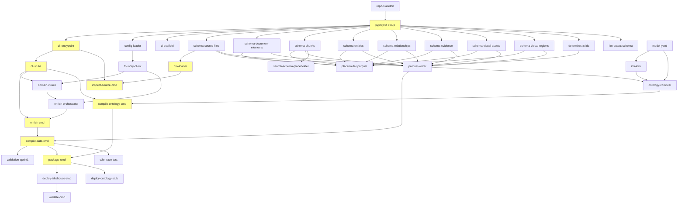

# PLAN-001: Implementation Plan — Fabric KG Builder

**Status:** Draft  
**Date:** 2026-06-24T12:42:17.255-07:00  
**Author:** Keyser (Lead / Architect)  
**Requested by:** Hyunsuk Shin  
**Traces to:** PRD §23–§25, SPEC-001 through SPEC-005, INFRA-001, DESIGN-001

---

## 1. Overview

### 1.1 Build Order

```
CSV-first → Parquet → Ontology → Deploy → Doc/Image/Search → Query Agent
```

The pipeline is built in layers, each validated before the next begins:

1. **Canonical data model + CSV ingestion** — proves the data contract
2. **LLM enrichment + Parquet writer** — proves the enrichment→canonical pipeline
3. **Ontology compiler + deployment** — proves the semantic layer
4. **Document/chunk/image extraction + AI Search** — extends to unstructured sources
5. **Query-time grounding agent** — post-MVP retrieval (DESIGN-001)

### 1.2 Guiding Principle

```
Canonical Parquet is the contract.
Everything downstream reads Parquet.
LLM output is intermediate — never source of truth.
```

### 1.3 Dev Environment

| Resource | Value |
|---|---|
| Subscription | Example-Subscription (`00000000-0000-0000-0000-000000000000`) |
| Resource Group | `example-rg` |
| Foundry (CognitiveServices) | `example-aiservices` / project `example-project` |
| Chat deployment (interim) | `gpt-4.1` |
| Chat deployment (target) | **GPT-5.5-mini** (not yet deployed) |
| Embedding deployment | `text-embedding-3-large` @ 1536 dims |
| AI Search | `example-search` (swedencentral) |
| Document Intelligence | `example-docintell` (westus3) |
| Blob Storage | `examplestorageacct` (eastus2) |
| Fabric Workspace ID | `11111111-1111-1111-1111-111111111111` |

---

## 2. Milestones

### M0 — Project Skeleton

| Attribute | Detail |
|---|---|
| **Objective** | Repo structure, pyproject.toml, CI scaffold, empty module layout |
| **Entry criteria** | PRD and specs approved |
| **Exit criteria** | `pip install -e .` succeeds; `fabric-kg --help` prints commands; pytest discovers test dirs |
| **PRD §23 satisfied** | None directly (foundation) |

### M1 — Canonical Data Model + CSV Pipeline

| Attribute | Detail |
|---|---|
| **Objective** | All 8 Pydantic schemas, deterministic ID module, CSV loader, placeholder Parquet, inspect-source command |
| **Entry criteria** | M0 complete |
| **Exit criteria** | `fabric-kg inspect-source --input examples/csv/sample.csv` exits 0; placeholder Parquet for all 8 tables written; unit tests for schemas, IDs, CSV loader pass |
| **PRD §23 satisfied** | AC-01 (init), AC-02 (inspect CSV) |

### M2 — LLM Enrichment + Parquet Writer

| Attribute | Detail |
|---|---|
| **Objective** | Foundry SDK integration, domain-intake, enrich command (mocked in tests), compile-data with Parquet writer, validation gates VAL-001–007 |
| **Entry criteria** | M1 complete |
| **Exit criteria** | `fabric-kg enrich` (mocked) + `fabric-kg compile-data` produces 8 valid Parquet files; entity→relationship→evidence trace passes; all Sprint 1 tests green |
| **PRD §23 satisfied** | AC-03 (enrich CSV), AC-07 (8 Parquet tables), AC-13 (e2e trace) |

### M3 — Ontology Compiler + Deploy

| Attribute | Detail |
|---|---|
| **Objective** | model.yaml definition, ids.lock.json management, compile-ontology produces Fabric definition parts, package command, deploy-lakehouse + deploy-ontology (mocked and dev) |
| **Entry criteria** | M2 complete |
| **Exit criteria** | `fabric-kg compile-ontology` produces valid definition.json + EntityTypes/; deterministic IDs verified; `fabric-kg package` bundles dist/; deploy commands exit 0 against mocks |
| **PRD §23 satisfied** | AC-08 (ontology compiled), AC-09 (deterministic IDs), AC-11 (deployable), AC-12 (validate) |

### M4 — Document/Chunk/Image Extraction + AI Search

| Attribute | Detail |
|---|---|
| **Objective** | PDF/DOCX/HTML extractors, chunking, table→HTML, image→Blob, Document Intelligence integration, visual_assets/visual_regions populated, compile-search, deploy-search |
| **Entry criteria** | M3 complete |
| **Exit criteria** | Sample document produces document_elements, chunks (incl. table_html, image_description), visual_assets with blob_url; AI Search index docs generated; VAL-008–014 pass |
| **PRD §23 satisfied** | AC-04 (doc extraction), AC-05 (blob upload), AC-06 (blob URLs everywhere), AC-10 (AI Search docs) |

### M5 — Query-Time Grounding Agent (Post-MVP)

| Attribute | Detail |
|---|---|
| **Objective** | Foundry Agent + `retrieve_grounding` tool; GQL Phase 1 → AI Search Phase 2 → grounded answer |
| **Entry criteria** | M4 complete; data deployed to dev |
| **Exit criteria** | `fabric-kg query "..."` returns cited answer from dev workspace; e2e integration test passes |
| **PRD §23 satisfied** | Post-MVP (DESIGN-001) |

---

## 3. Epics and Tasks

### 3.1 Sprint 1 — Foundation (M0 + M1 + M2 + M3)

#### Epic A: Project Skeleton (M0)

| task_id | title | owner | depends_on | spec_ref | DoD | test_ref |
|---|---|---|---|---|---|---|
| `repo-skeleton` | Creating repository structure | Keyser | — | SPEC-001 §3 | All dirs from §3 exist; .gitignore excludes build/dist | `test_project_structure.py` |
| `pyproject-setup` | Setting up pyproject.toml with deps | Keyser | — | SPEC-001 §4 | `pip install -e .` succeeds; click, pyarrow, pydantic, azure-ai-projects installed | `test_cli_entry.py` |
| `cli-entrypoint` | Creating CLI entry point with Click | Keyser | `pyproject-setup` | SPEC-001 §7 | `fabric-kg --help` lists all commands; unknown command exits non-zero | `test_cli_entry.py` |
| `cli-stubs` | Adding stub commands for all stages | Keyser | `cli-entrypoint` | SPEC-001 §7 | Each command prints "not implemented" and exits 0 | `test_cli_entry.py` |
| `config-loader` | Implementing config loader with .env+yaml | Fenster | `pyproject-setup` | SPEC-001 §5 | Loads fabric-kg.yaml + .env; precedence CLI>env>yaml>default; VAL-025/026 pass | `test_config_loader.py` |
| `ci-scaffold` | Adding pytest + GitHub Actions CI | Hockney | `pyproject-setup` | SPEC-005 §3 | `pytest` discovers tests; CI workflow runs on push | — |

#### Epic B: Canonical Data Model (M1)

| task_id | title | owner | depends_on | spec_ref | DoD | test_ref |
|---|---|---|---|---|---|---|
| `schema-source-files` | Defining source_files Pydantic+PyArrow schema | Fenster | `pyproject-setup` | SPEC-002 §3.1 | Schema matches all columns from SPEC-002; pyarrow schema serializes | `test_schemas.py` |
| `schema-document-elements` | Defining document_elements schema | Fenster | `pyproject-setup` | SPEC-002 §3.2 | Schema matches spec; placeholder Parquet writable | `test_schemas.py`, `test_placeholder_schemas.py` |
| `schema-chunks` | Defining chunks schema | Fenster | `pyproject-setup` | SPEC-002 §3.4 | Schema with related_entity_ids as list<string> | `test_schemas.py`, `test_placeholder_schemas.py` |
| `schema-entities` | Defining entities schema | Fenster | `pyproject-setup` | SPEC-002 §3.5 | Schema with aliases as native array; search_aliases column | `test_schemas.py` |
| `schema-relationships` | Defining relationships schema | Fenster | `pyproject-setup` | SPEC-002 §3.6 | All FK columns present | `test_schemas.py` |
| `schema-evidence` | Defining evidence schema | Fenster | `pyproject-setup` | SPEC-002 §3.7 | All source_type variants covered | `test_schemas.py` |
| `schema-visual-assets` | Defining visual_assets schema | Fenster | `pyproject-setup` | SPEC-002 §3.8 | blob_url, image_hash, description columns | `test_schemas.py`, `test_placeholder_schemas.py` |
| `schema-visual-regions` | Defining visual_regions schema | Fenster | `pyproject-setup` | SPEC-002 §3.9 | polygon_json, identified_entity_id columns | `test_schemas.py`, `test_placeholder_schemas.py` |
| `deterministic-ids` | Implementing deterministic ID generation module | Fenster | `pyproject-setup` | SPEC-002 §5 | SHA-256 hashing with prefix; same input = same ID; tests pass | `test_ids.py`, `test_chunk_ids.py`, `test_content_hash.py` |
| `csv-loader` | Implementing CSV/TSV/XLSX loader | Fenster | `schema-source-files` | SPEC-002 §6 | Loads CSV to dicts; handles BOM, whitespace; raises CsvLoadError on invalid | `test_csv_loader.py` |
| `sample-csv` | Creating sample CSV fixture | Fenster | — | SPEC-001 §3 | `examples/csv/sample.csv` with ≥2 data rows matching a Surface domain | — |
| `inspect-source-cmd` | Implementing inspect-source command | Keyser | `csv-loader`, `cli-entrypoint` | SPEC-001 §7 | Prints schema profile (column names + inferred types); exits 0 | `test_cli_entry.py` (AC-02) |
| `placeholder-parquet` | Writing placeholder Parquet for all 8 tables | Fenster | `schema-*` (all 8) | SPEC-002 §7 | Empty-but-typed .parquet in build/parquet/{table}/ | `test_placeholder_schemas.py` |

#### Epic C: LLM Enrichment (M2)

| task_id | title | owner | depends_on | spec_ref | DoD | test_ref |
|---|---|---|---|---|---|---|
| `foundry-client` | Setting up Foundry SDK client wrapper | Verbal | `config-loader` | SPEC-004 §9 | Client initializes with endpoint+key from config; mockable interface | `test_foundry_client.py` |
| `domain-intake` | Implementing domain-intake / set-domain command | Verbal | `foundry-client`, `cli-stubs` | SPEC-004 §2 | `set-domain --prompt "..."` writes domain.json; domain text in USER role only | VAL-024 |
| `enrich-orchestrator` | Building enrich orchestrator with checkpointing | Verbal | `foundry-client`, `domain-intake` | SPEC-004 §3–§7 | Batch LLM calls; checkpoint per source; --resume/--force; produces intermediate JSON | `test_csv_pipeline.py` |
| `llm-output-schema` | Defining LLM output JSON schema (Pydantic) | Verbal | `pyproject-setup` | SPEC-004 §4 | Pydantic models for entities/rels/evidence/chunks/visual; JSON Schema exported | `test_llm_output_schema.py` |
| `enrich-cmd` | Wiring enrich CLI command | Verbal | `enrich-orchestrator`, `cli-stubs` | SPEC-001 §7 | `fabric-kg enrich --input ... --out ...` exits 0; mocked LLM returns fixture | AC-03 |
| `parquet-writer` | Implementing Parquet writer module | Fenster | `schema-*`, `deterministic-ids` | SPEC-002 §7 | Writes list[dict] → typed Parquet; round-trip matches | `test_parquet_writer.py` |
| `compile-data-cmd` | Implementing compile-data command | Fenster | `parquet-writer`, `enrich-cmd` | SPEC-001 §7, SPEC-002 §7 | Reads enriched JSON → writes 8 Parquet files; VAL-001–007 pass | `test_csv_pipeline.py`, AC-07 |
| `validation-sprint1` | Implementing Sprint 1 validation gates | Hockney | `compile-data-cmd` | SPEC-005 §2 | VAL-001–007, VAL-015–018, VAL-021, VAL-025–027 raise/pass correctly | `test_validators.py` |

#### Epic D: Ontology Compiler + Deploy (M3)

| task_id | title | owner | depends_on | spec_ref | DoD | test_ref |
|---|---|---|---|---|---|---|
| `model-yaml` | Authoring ontology/model.yaml | McManus | — | SPEC-003 §3–§5 | model.yaml with ≥1 entity type + ≥1 relationship type per module; inversePolicy set | `test_ontology_compiler.py` |
| `ids-lock` | Creating ontology/ids.lock.json | McManus | `model-yaml` | SPEC-003 §6 | All types from model.yaml have stable numeric IDs; no duplicates | `test_ids.py` |
| `ontology-compiler` | Building ontology compiler (model.yaml → definition parts) | McManus | `model-yaml`, `ids-lock`, `parquet-writer` | SPEC-003 §7 | Produces definition.json + EntityTypes/{ID}/; uses ids.lock; passes VAL-015–017 | `test_ontology_compiler.py`, AC-08, AC-09 |
| `compile-ontology-cmd` | Wiring compile-ontology CLI command | McManus | `ontology-compiler`, `cli-stubs` | SPEC-001 §7 | `fabric-kg compile-ontology --out build/ontology` exits 0 | `test_ontology_compile.py` |
| `env-json` | Creating ontology/environments/dev.json | McManus | — | SPEC-001 §6 | Contains workspace_id, lakehouse_item_id; keys match spec | — |
| `package-cmd` | Implementing package command | Keyser | `compile-data-cmd`, `compile-ontology-cmd` | SPEC-001 §7 | Bundles build/ → dist/; VAL-021 (placeholders present) | `test_placeholders.py` |
| `deploy-lakehouse-stub` | Creating deploy-lakehouse command (mocked) | Keyser | `package-cmd` | SPEC-003 §11 | Exits 0; calls mocked Fabric REST; structured data → Lakehouse only | `test_deploy_lakehouse.py` |
| `deploy-ontology-stub` | Creating deploy-ontology command (mocked) | McManus | `package-cmd` | SPEC-003 §8 | Exits 0; pushes ontology parts to mocked REST | — |
| `validate-cmd` | Implementing validate command | Hockney | `deploy-lakehouse-stub` | SPEC-001 §7 | `fabric-kg validate` runs all applicable VAL rules; prints PASS/FAIL | AC-12 |
| `search-schema-placeholder` | Creating AI Search schema placeholder | Keyser | `schema-chunks` | SPEC-001 §7 | `build/search/kg-chunks/index.schema.json` exists; valid JSON | — |
| `e2e-trace-test` | Writing entity→relationship→evidence trace test | Hockney | `compile-data-cmd` | SPEC-005 §7 | Join on FK produces complete row with entity_id, rel_type, evidence_id, text | AC-13, `test_e2e_trace.py` |

### 3.2 Sprint 2 — Document Extraction + AI Search (M4)

#### Epic E: Document Extraction

| task_id | title | owner | depends_on | spec_ref | DoD | test_ref |
|---|---|---|---|---|---|---|
| `pdf-extractor` | Implementing PDF text/section extractor | Fenster | `schema-document-elements` | SPEC-004 §8, PRD §13.1 | Extracts sections, pages, reading order from PDF | `test_document_extractor.py` |
| `docx-extractor` | Implementing DOCX section/paragraph extractor | Fenster | `schema-document-elements` | PRD §13.2 | Extracts headings, paragraphs, inline images, tables | `test_document_extractor.py` |
| `html-extractor` | Implementing HTML section extractor | Fenster | `schema-document-elements` | PRD §13.3 | Extracts headings, imgs, figcaptions, tables | `test_document_extractor.py` |
| `chunker` | Implementing traditional text chunker | Fenster | `schema-chunks`, `deterministic-ids` | SPEC-002 §3.4, PRD §10 | Creates section_text chunks with correct FKs; deterministic chunk_ids | `test_chunker.py` |
| `table-extractor` | Extracting structured tables from documents | Fenster | `schema-document-elements` | PRD §10.3 | Table → structured records + table_id FK | `test_table_extractor.py` |
| `table-html-chunker` | Converting tables to HTML chunks | Fenster | `chunker`, `table-extractor` | PRD §10.3, SPEC-002 §3.4 | Produces table_html chunks with valid `<table>` content_html | `test_table_chunker.py` |

#### Epic F: Visual Assets + Blob Storage

| task_id | title | owner | depends_on | spec_ref | DoD | test_ref |
|---|---|---|---|---|---|---|
| `image-extractor` | Extracting images/figures from documents | Verbal | `pdf-extractor`, `docx-extractor` | PRD §13.1–§13.4 | Extracts embedded images; records asset_type, caption, alt_text | `test_visual_assets.py` |
| `blob-uploader` | Implementing Blob Storage upload (mocked) | Verbal | `config-loader` | SPEC-001 §3, INFRA-001 §3 | Uploads binary to container; returns blob_url; dedup by image_hash | `test_blob_uploader.py` |
| `visual-assets-gen` | Generating visual_assets records | Verbal | `image-extractor`, `blob-uploader` | SPEC-002 §3.8 | Records with blob_url populated; VAL-010 passes | `test_visual_assets.py` |
| `docintel-integration` | Integrating Document Intelligence for visual_regions | Verbal | `image-extractor` | SPEC-004 §8, INFRA-001 §2 | OCR + bounding polygons → visual_region rows; polygon_json populated; VAL-028 | `test_visual_regions.py` |
| `visual-regions-gen` | Generating visual_regions records | Verbal | `docintel-integration` | SPEC-002 §3.9 | Callout/OCR regions with image_id FK; VAL-011 passes | `test_visual_regions.py` |

#### Epic G: Enrichment E2E for Documents

| task_id | title | owner | depends_on | spec_ref | DoD | test_ref |
|---|---|---|---|---|---|---|
| `enrich-documents` | Extending enrich for document sources | Verbal | `enrich-orchestrator`, `pdf-extractor`, `docx-extractor` | SPEC-004 §3–§7 | Enrich produces entities/rels/evidence from doc sources | `test_document_pipeline.py` |
| `evidence-text-linking` | Linking text evidence to entities | Verbal | `enrich-documents` | SPEC-002 §3.7 | evidence rows with source_type=chunk/document_span; chunk_id FK set | `test_evidence_linking.py` |
| `evidence-visual-linking` | Linking visual evidence to entities | Verbal | `visual-regions-gen`, `enrich-documents` | SPEC-002 §3.7 | evidence rows with source_type=figure_callout; blob_url+visual_region_id set | `test_evidence_linking.py` |
| `parquet-writer-e2e` | Running full Parquet writer with document data | Fenster | `enrich-documents`, `parquet-writer` | SPEC-002 §7 | All 8 tables populated from doc enrichment; VAL-008–012 pass | `test_document_pipeline.py` |

#### Epic H: AI Search Pipeline

| task_id | title | owner | depends_on | spec_ref | DoD | test_ref |
|---|---|---|---|---|---|---|
| `compile-search-cmd` | Implementing compile-search command | Keyser | `parquet-writer-e2e`, `schema-chunks` | SPEC-001 §7, SPEC-002 §11 | Generates index docs from chunks + visual_assets; VAL-019 passes | `test_search_index_schema.py` |
| `search-embeddings` | Generating embeddings for search docs | Verbal | `compile-search-cmd`, `foundry-client` | SPEC-004 §10, INFRA-001 §1b | embedding_vector populated (1536-dim); mocked in tests | — |
| `search-entity-linkage` | Adding entity linkage fields to search docs | Fenster | `compile-search-cmd` | SPEC-002 §11.3–§11.6 | entity_ids, canonical_key, entity_aliases derived at index-build time | `test_search_index_schema.py` |
| `deploy-search-cmd` | Implementing deploy-search command | Keyser | `compile-search-cmd` | SPEC-001 §7 | Pushes index schema + docs to AI Search (mocked); VAL-013/023 pass | `test_deploy_lakehouse.py` |
| `push-pipeline` | Building KG→AI Search sync push pipeline | Fenster | `search-entity-linkage` | SPEC-002 §11.6 | Parquet changes trigger search doc re-generation | — |
| `validation-sprint2` | Implementing Sprint 2 validation gates | Hockney | `parquet-writer-e2e` | SPEC-005 §2 | VAL-008–014, VAL-023, VAL-024, VAL-028 raise/pass correctly | `test_validators.py` |
| `compile-ontology-e2e` | Running compile-ontology with full data | McManus | `parquet-writer-e2e`, `ontology-compiler` | SPEC-003 §7, §12 | Bridge gates BRG-001–010 pass; bindings resolve | `test_ontology_compile.py` |

---

## 4. Critical Path & Parallelization

### 4.1 Dependency Graph



### 4.2 Critical Path (Sprint 1 Demo)

```
pyproject-setup → cli-entrypoint → cli-stubs → inspect-source-cmd
                                             → enrich-cmd → compile-data-cmd → compile-ontology-cmd → package-cmd
```

**Elapsed time driver:** The enrichment and compile-data path is the longest chain. Schemas and ontology model.yaml can be built in parallel.

### 4.3 Parallelization Opportunities

| Parallel track | Tasks | Owner |
|---|---|---|
| **Track 1:** Schemas (all 8) | `schema-*` | Fenster |
| **Track 2:** CLI + Config | `cli-entrypoint`, `config-loader`, `cli-stubs` | Keyser |
| **Track 3:** Ontology model | `model-yaml`, `ids-lock`, `env-json` | McManus |
| **Track 4:** LLM integration | `foundry-client`, `llm-output-schema`, `domain-intake` | Verbal |
| **Track 5:** CI + Test infra | `ci-scaffold`, `sample-csv` | Hockney/Fenster |

---

## 5. Definition of Done

### 5.1 MVP DoD (PRD §23 — 13 Criteria)

| AC# | Criterion | Milestone | Verified by |
|---|---|---|---|
| AC-01 | `fabric-kg init` works | M1 | TC-AC-01 |
| AC-02 | Sample CSV inspected | M1 | TC-AC-02 |
| AC-03 | CSV enriched to canonical JSON | M2 | TC-AC-03 |
| AC-04 | Document produces text/chunk/table/visual | M4 | TC-AC-04 |
| AC-05 | Images uploaded to Blob | M4 | TC-AC-05 |
| AC-06 | Blob URLs in all 6 locations | M4 | TC-AC-06 |
| AC-07 | 8 Parquet tables written | M2 | TC-AC-07 |
| AC-08 | Ontology compiled from model.yaml | M3 | TC-AC-08 |
| AC-09 | Deterministic IDs from ids.lock | M3 | TC-AC-09 |
| AC-10 | AI Search docs for chunks/tables/images | M4 | TC-AC-10 |
| AC-11 | Deployable to Fabric dev workspace | M3 | TC-AC-11 |
| AC-12 | CLI validate passes | M3 | TC-AC-12 |
| AC-13 | Entity→rel→evidence e2e trace | M2 | TC-AC-13 |

### 5.2 Sprint 1 DoD

- [ ] All M0+M1+M2+M3 tasks marked done
- [ ] `fabric-kg inspect-source` → `compile-data` → `compile-ontology` → `package` demo runs end-to-end
- [ ] 28+ unit tests pass (SPEC-005 §5)
- [ ] Integration test `test_csv_pipeline.py` passes
- [ ] Integration test `test_ontology_compile.py` passes
- [ ] Integration test `test_validation_gates.py` passes
- [ ] CI green on push

### 5.3 Sprint 2 DoD

- [ ] All M4 tasks marked done
- [ ] Document extraction produces populated document_elements, chunks, visual_assets, visual_regions
- [ ] Blob URLs present in visual_assets, evidence, chunks, document_elements, AI Search docs, ontology node properties
- [ ] AI Search compile produces valid index documents
- [ ] 10+ additional validator tests pass (SPEC-005 §6)
- [ ] Integration test `test_document_pipeline.py` passes
- [ ] Bridge gates BRG-001–010 pass

---

## 6. Risks & Open Decisions

| # | Risk / Decision | Impact | Recommended Default | Decider | Status |
|---|---|---|---|---|---|
| 1 | **GPT-5.5-mini not deployed** in dev sandbox | Cannot test target model | Use gpt-4.1 interim; deploy GPT-5.5-mini when available | Hyunsuk / Infra | Open |
| 2 | **Lakehouse item ID** not yet known | deploy-lakehouse needs it | Create Lakehouse in workspace 9802a28a; store ID in dev.json | Keyser | Open |
| 3 | **fabric-cicd vs REST wrapper** for ontology deploy | Affects deploy-ontology impl | Start with fabric-cicd (SPEC-003 §8); fall back to REST if issues | McManus | Open |
| 4 | **Auth: SPN vs DefaultAzureCredential** | CI needs SPN; dev uses az login | DefaultAzureCredential for all; SPN env vars in CI secrets only | Keyser | Recommended |
| 5 | **AI Search in MVP or post-MVP** | Scope creep risk | AI Search compile is Sprint 2; deploy-search is optional (search.enabled=false default) | Hyunsuk | Recommended |
| 6 | **First sample document** for Sprint 2 | No fixture yet | Use Surface Troubleshooting PDFs from `sample_data\` | Fenster | Pending |
| 7 | **Parquet partitioning** | Performance at scale | Single file per table for MVP; partition later if needed | Fenster | Locked |
| 8 | **properties_json vs map column** on entities | Schema evolution | Keep current flat columns for MVP; revisit in v2 | Fenster | Deferred |
| 9 | **Embedding dimension lock** | Reindex cost if changed | Lock at 1536 (text-embedding-3-large); document reindex requirement | Keyser | Locked |
| 10 | **CI/CD platform** | Pipeline hosting | GitHub Actions (repo is on GitHub) | Keyser | Locked |

---

## 7. Consolidated Task Tables

### 7.1 Sprint 1 Task Table

| task_id | title | owner | depends_on | spec_ref | DoD |
|---|---|---|---|---|---|
| `repo-skeleton` | Creating repository structure | Keyser | — | SPEC-001 §3 | All dirs from §3 exist; .gitignore excludes build/dist |
| `pyproject-setup` | Setting up pyproject.toml with deps | Keyser | — | SPEC-001 §4 | `pip install -e .` succeeds |
| `cli-entrypoint` | Creating CLI entry point with Click | Keyser | `pyproject-setup` | SPEC-001 §7 | `fabric-kg --help` lists all commands |
| `cli-stubs` | Adding stub commands for all stages | Keyser | `cli-entrypoint` | SPEC-001 §7 | Each command prints "not implemented" |
| `config-loader` | Implementing config loader with .env+yaml | Fenster | `pyproject-setup` | SPEC-001 §5 | Loads yaml+.env; VAL-025/026 pass |
| `ci-scaffold` | Adding pytest + GitHub Actions CI | Hockney | `pyproject-setup` | SPEC-005 §3 | pytest runs; CI triggers on push |
| `schema-source-files` | Defining source_files schema | Fenster | `pyproject-setup` | SPEC-002 §3.1 | Schema matches spec exactly |
| `schema-document-elements` | Defining document_elements schema | Fenster | `pyproject-setup` | SPEC-002 §3.2 | Schema matches spec; placeholder writable |
| `schema-chunks` | Defining chunks schema | Fenster | `pyproject-setup` | SPEC-002 §3.4 | related_entity_ids as list<string> |
| `schema-entities` | Defining entities schema | Fenster | `pyproject-setup` | SPEC-002 §3.5 | aliases as native array |
| `schema-relationships` | Defining relationships schema | Fenster | `pyproject-setup` | SPEC-002 §3.6 | All FK columns present |
| `schema-evidence` | Defining evidence schema | Fenster | `pyproject-setup` | SPEC-002 §3.7 | All source_type variants |
| `schema-visual-assets` | Defining visual_assets schema | Fenster | `pyproject-setup` | SPEC-002 §3.8 | blob_url, image_hash columns |
| `schema-visual-regions` | Defining visual_regions schema | Fenster | `pyproject-setup` | SPEC-002 §3.9 | polygon_json column |
| `deterministic-ids` | Implementing deterministic ID generation | Fenster | `pyproject-setup` | SPEC-002 §5 | Same input = same ID |
| `csv-loader` | Implementing CSV/TSV/XLSX loader | Fenster | `schema-source-files` | SPEC-002 §6 | Handles BOM, whitespace; raises on invalid |
| `sample-csv` | Creating sample CSV fixture | Fenster | — | SPEC-001 §3 | ≥2 data rows; Surface domain |
| `inspect-source-cmd` | Implementing inspect-source command | Keyser | `csv-loader`, `cli-entrypoint` | SPEC-001 §7 | Prints schema profile; exits 0 |
| `placeholder-parquet` | Writing placeholder Parquet (all 8 tables) | Fenster | `schema-source-files`, `schema-document-elements`, `schema-chunks`, `schema-entities`, `schema-relationships`, `schema-evidence`, `schema-visual-assets`, `schema-visual-regions` | SPEC-002 §7 | Empty-but-typed files written |
| `foundry-client` | Setting up Foundry SDK client wrapper | Verbal | `config-loader` | SPEC-004 §9 | Mockable interface; init from config |
| `domain-intake` | Implementing set-domain command | Verbal | `foundry-client`, `cli-stubs` | SPEC-004 §2 | domain.json written; USER role only |
| `enrich-orchestrator` | Building enrich orchestrator | Verbal | `foundry-client`, `domain-intake` | SPEC-004 §3–§7 | Checkpoint+resume; produces intermediate JSON |
| `llm-output-schema` | Defining LLM output JSON schema | Verbal | `pyproject-setup` | SPEC-004 §4 | Pydantic models; JSON Schema exported |
| `enrich-cmd` | Wiring enrich CLI command | Verbal | `enrich-orchestrator`, `cli-stubs` | SPEC-001 §7 | Exits 0 with mocked LLM |
| `parquet-writer` | Implementing Parquet writer module | Fenster | `schema-source-files`, `schema-entities`, `deterministic-ids` | SPEC-002 §7 | Round-trip correct; types match |
| `compile-data-cmd` | Implementing compile-data command | Fenster | `parquet-writer`, `enrich-cmd` | SPEC-001 §7 | 8 Parquet files; VAL-001–007 pass |
| `validation-sprint1` | Implementing Sprint 1 validation gates | Hockney | `compile-data-cmd` | SPEC-005 §2 | VAL-001–007, 015–018, 021, 025–027 |
| `model-yaml` | Authoring ontology/model.yaml | McManus | — | SPEC-003 §3–§5 | ≥1 entity + ≥1 rel type per module |
| `ids-lock` | Creating ids.lock.json | McManus | `model-yaml` | SPEC-003 §6 | Stable numeric IDs; no duplicates |
| `ontology-compiler` | Building ontology compiler | McManus | `model-yaml`, `ids-lock`, `parquet-writer` | SPEC-003 §7 | definition.json + EntityTypes/ produced |
| `compile-ontology-cmd` | Wiring compile-ontology command | McManus | `ontology-compiler`, `cli-stubs` | SPEC-001 §7 | Exits 0; valid output |
| `env-json` | Creating dev.json environment config | McManus | — | SPEC-001 §6 | workspace_id populated |
| `package-cmd` | Implementing package command | Keyser | `compile-data-cmd`, `compile-ontology-cmd` | SPEC-001 §7 | build/ → dist/ bundle |
| `deploy-lakehouse-stub` | Creating deploy-lakehouse (mocked) | Keyser | `package-cmd` | SPEC-003 §11 | Exits 0; structured → Lakehouse |
| `deploy-ontology-stub` | Creating deploy-ontology (mocked) | McManus | `package-cmd` | SPEC-003 §8 | Exits 0; parts pushed |
| `validate-cmd` | Implementing validate command | Hockney | `deploy-lakehouse-stub` | SPEC-001 §7 | Runs all VAL rules; PASS/FAIL |
| `search-schema-placeholder` | Creating AI Search schema placeholder | Keyser | `schema-chunks` | SPEC-001 §7 | index.schema.json exists |
| `e2e-trace-test` | Writing e2e trace integration test | Hockney | `compile-data-cmd` | SPEC-005 §7 | entity→rel→evidence join succeeds |

**Sprint 1 total: 37 tasks**

### 7.2 Sprint 2 Task Table

| task_id | title | owner | depends_on | spec_ref | DoD |
|---|---|---|---|---|---|
| `pdf-extractor` | Implementing PDF text/section extractor | Fenster | `schema-document-elements` | SPEC-004 §8, PRD §13.1 | Sections + pages extracted |
| `docx-extractor` | Implementing DOCX extractor | Fenster | `schema-document-elements` | PRD §13.2 | Headings, paras, images, tables |
| `html-extractor` | Implementing HTML extractor | Fenster | `schema-document-elements` | PRD §13.3 | Headings, imgs, tables |
| `chunker` | Implementing traditional text chunker | Fenster | `schema-chunks`, `deterministic-ids` | SPEC-002 §3.4, PRD §10 | section_text chunks; FKs correct |
| `table-extractor` | Extracting structured tables | Fenster | `schema-document-elements` | PRD §10.3 | Structured records + table_id |
| `table-html-chunker` | Converting tables to HTML chunks | Fenster | `chunker`, `table-extractor` | PRD §10.3 | Valid `<table>` HTML in content_html |
| `image-extractor` | Extracting images/figures | Verbal | `pdf-extractor`, `docx-extractor` | PRD §13.1–§13.4 | asset_type, caption, alt_text |
| `blob-uploader` | Implementing Blob upload (mocked) | Verbal | `config-loader` | INFRA-001 §3 | blob_url returned; dedup by hash |
| `visual-assets-gen` | Generating visual_assets records | Verbal | `image-extractor`, `blob-uploader` | SPEC-002 §3.8 | blob_url populated; VAL-010 |
| `docintel-integration` | Integrating Document Intelligence | Verbal | `image-extractor` | SPEC-004 §8, INFRA-001 §2 | polygon_json populated; VAL-028 |
| `visual-regions-gen` | Generating visual_regions records | Verbal | `docintel-integration` | SPEC-002 §3.9 | image_id FK correct; VAL-011 |
| `enrich-documents` | Extending enrich for documents | Verbal | `enrich-orchestrator`, `pdf-extractor`, `docx-extractor` | SPEC-004 §3–§7 | Entities/rels/evidence from docs |
| `evidence-text-linking` | Linking text evidence | Verbal | `enrich-documents` | SPEC-002 §3.7 | source_type=chunk; chunk_id FK set |
| `evidence-visual-linking` | Linking visual evidence | Verbal | `visual-regions-gen`, `enrich-documents` | SPEC-002 §3.7 | source_type=figure_callout; blob_url set |
| `parquet-writer-e2e` | Full Parquet writer with doc data | Fenster | `enrich-documents`, `parquet-writer` | SPEC-002 §7 | All 8 tables; VAL-008–012 pass |
| `compile-search-cmd` | Implementing compile-search command | Keyser | `parquet-writer-e2e`, `schema-chunks` | SPEC-001 §7, SPEC-002 §11 | Index docs generated; VAL-019 |
| `search-embeddings` | Generating embeddings for search | Verbal | `compile-search-cmd`, `foundry-client` | SPEC-004 §10 | 1536-dim vectors; mocked in tests |
| `search-entity-linkage` | Adding entity linkage to search docs | Fenster | `compile-search-cmd` | SPEC-002 §11.3–§11.6 | entity_ids, canonical_key derived |
| `deploy-search-cmd` | Implementing deploy-search command | Keyser | `compile-search-cmd` | SPEC-001 §7 | Pushes to AI Search; VAL-013/023 |
| `push-pipeline` | Building KG→Search sync push pipeline | Fenster | `search-entity-linkage` | SPEC-002 §11.6 | Changes trigger re-generation |
| `validation-sprint2` | Implementing Sprint 2 validation gates | Hockney | `parquet-writer-e2e` | SPEC-005 §2 | VAL-008–014, 023, 024, 028 |
| `compile-ontology-e2e` | Running compile-ontology with full data | McManus | `parquet-writer-e2e`, `ontology-compiler` | SPEC-003 §7, §12 | BRG-001–010 pass |

**Sprint 2 total: 22 tasks**

---

## 8. Summary

- **Total tasks:** 59 (37 Sprint 1 + 22 Sprint 2)
- **Critical path:** pyproject → CLI → enrich → compile-data → compile-ontology → package
- **Parallelization:** 5 concurrent tracks in Sprint 1
- **MVP exit gate:** All 13 PRD §23 acceptance criteria pass automated tests
- **Post-MVP:** M5 (query agent) per DESIGN-001 — estimated 2–3 days after M4

---

*End of PLAN-001.*
