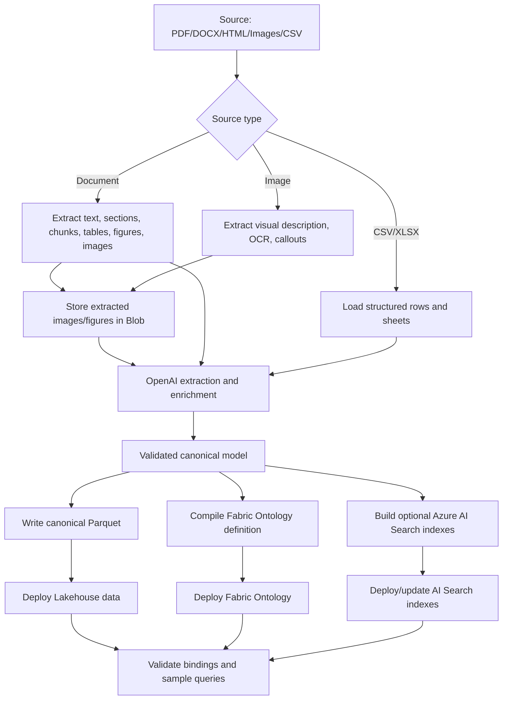

# PRD: Fabric KG Builder

> **NOTE: Specs supersede this PRD**
>
> For the following topics, the authoritative source is **[`docs/specs/SPEC-001`](./specs/SPEC-001-architecture-and-cli.md) through [`SPEC-005`](./specs/)** and **[`docs/infra/INFRA-001`](./infra/INFRA-001-azure-resources.md)**:
>
> | Topic | Canonical answer |
> |---|---|
> | LLM SDK | Microsoft Foundry SDK (`azure-ai-projects`) — not raw OpenAI SDK |
> | CLI command names | `deploy-lakehouse` (not `deploy-data`), `compile-search` (not `compile-search-index`) |
> | Model defaults | GPT-5.5-mini (chat/enrichment target; interim dev gpt-4.1), text-embedding-3-large @ 1536 dims |
> | Vision default | Chat deployment (multimodal); `example-vision`/gpt-4o as alternative |
> | Stage order | domain-intake → inspect-source → enrich → compile-data → compile-ontology → compile-search → package → deploy-lakehouse → deploy-ontology → deploy-search → validate |
>
> This PRD is preserved verbatim below as the original captured requirements document.

Date: 2026-06-24  
Status: Draft for new project kickoff  
Proposed repo: `fabric-kg-builder`  
Proposed CLI: `fabric-kg`  
Proposed Python package: `fabric_kg_builder`

## 1. Product Summary

Fabric KG Builder is a CLI tool that turns documents, images, figures, tables, and tabular files into a deployable Microsoft Fabric knowledge graph system.

It ingests source files, performs traditional document chunking, extracts text/tables/images/figures, stores visual assets in Blob Storage, uses OpenAI models for extraction and enrichment, writes canonical Parquet tables, generates a Fabric Ontology definition over those tables, optionally builds Azure AI Search indexes for vector retrieval, and deploys data plus ontology through Fabric CI/CD / Fabric REST APIs.

```text
Documents / images / figures / CSV files
  -> traditional document chunking
  -> text, layout, table, image, and figure extraction
  -> image/figure storage in Blob
  -> OpenAI extraction and enrichment
  -> validated canonical entities, relationships, chunks, and evidence
  -> canonical Parquet tables
  -> optional Azure AI Search vector indexes
  -> Fabric Lakehouse
  -> Fabric Ontology definition
  -> fabric-cicd deployment
```

The product is not a one-off Surface demo. It is a reusable framework for building domain-specific knowledge graphs and retrieval indexes from semi-structured documents, structured files, and visual assets.

## 2. Problem

Teams often have valuable knowledge spread across PDFs, Word documents, HTML pages, CSV exports, spreadsheets, manuals, screenshots, diagrams, photos, tables, and figures. The knowledge is not directly usable as a governed Fabric ontology or as a high-quality retrieval system because:

- documents mix prose, procedures, tables, figures, images, warnings, and references;
- images and figures often contain information not repeated in text;
- diagrams contain callouts, labels, arrows, and spatial relationships;
- tables can be lost if flattened incorrectly;
- traditional chunking is still needed for search, citation, grounding, and fallback retrieval;
- CSVs have structure but often lack semantic meaning;
- LLM extraction produces useful but unstable intermediate output;
- manually building Fabric ontology items is not reproducible;
- data and ontology deployment must be CI/CD-controlled;
- evidence and provenance are often lost during extraction;
- graph models often confuse labels with identity and retrieval rows with true relationships.

The tool must convert these sources into stable canonical data, deployable ontology definitions, and optionally retrieval-ready AI Search indexes.

## 3. Goals

1. Build a CLI that ingests documents, images, figures, and CSV/tabular files.
2. Include traditional document chunking as a first-class pipeline stage.
3. Extract text, sections, tables, rows, columns, images, figures, captions, visual callouts, and procedures.
4. Extract tables both as structured table cells and as HTML/text representations suitable for vector indexing.
5. Store extracted images and figures in Blob Storage.
6. Include Blob URLs in document element records, AI Search index documents, and Fabric Ontology node properties.
7. Use OpenAI models to extract, classify, normalize, and enrich entities, relationships, visual evidence, chunks, and document evidence.
8. Write canonical Parquet tables as the durable data contract.
9. Generate a Fabric Ontology definition on top of the Parquet tables.
10. Optionally generate Azure AI Search indexes for chunks, document elements, images, tables, and vectors.
11. Deploy Fabric data and ontology using fabric-cicd / Fabric REST APIs.
12. Support deterministic, repeatable deployments across dev/test/prod.
13. Preserve source evidence and document/visual structure so every fact is traceable.
14. Support placeholder generation for folders, files, tables, bindings, images, figures, search indexes, and ontology parts.
15. Keep the model source-controlled and versionable.
16. Avoid modeling mistakes learned from the existing AI Search prototype.

## 4. Non-Goals

1. Do not build a UI in the first release.
2. Do not make raw LLM output the source of truth.
3. Do not rely on automatic OWL-style reasoning unless Fabric explicitly supports it.
4. Do not start with PDF-heavy or image-heavy complexity before proving the CSV-to-Parquet-to-ontology path.
5. Do not couple the new tool to the Surface service-guide demo.
6. Do not make Azure AI Search the canonical data store. AI Search is a retrieval/indexing layer; Parquet remains the canonical contract.
7. Do not manually create or edit ontology items in Fabric as the standard workflow.
8. Do not attempt full computer-vision annotation tooling in MVP; start with extractable figures, captions, image descriptions, OCR, Blob URLs, and callouts.

## 5. Users

| User | Need |
|---|---|
| Data engineer | Convert source files into canonical Parquet tables and deploy to Fabric |
| Knowledge engineer | Define entity and relationship models in ontology/model files |
| AI engineer | Tune extraction, enrichment, chunking, and image-understanding prompts |
| Search engineer | Build Azure AI Search chunk/vector indexes for retrieval and grounding |
| Fabric developer | Deploy Lakehouse data and Fabric Ontology items through CI/CD |
| Domain expert | Review extracted entities, relationships, chunks, image evidence, and source evidence |
| Support / operations user | Query graph-grounded answers with trustworthy text and visual provenance |

## 6. Core Design Principle

```text
LLM output is intermediate.
Canonical Parquet is the data contract.
Fabric Ontology is the semantic layer.
Azure AI Search is an optional retrieval layer.
Images, figures, tables, chunks, and document structure are first-class evidence.
CI/CD deploys KG data, ontology, and retrieval artifacts from versioned outputs.
```

## 7. Source Types

| Source type | Extraction behavior | LLM behavior | Output |
|---|---|---|---|
| CSV / TSV | Load structured rows directly | Infer semantics, map columns, normalize values, enrich entities/relationships | Canonical Parquet |
| XLSX | Load sheets/tables | Same as CSV, with sheet/table metadata | Canonical Parquet |
| PDF | Extract text, page layout, chunks, tables, figures, embedded images, captions | Extract entities, procedures, relationships, visual evidence | Parquet + Blob images + optional AI Search |
| DOCX | Extract headings, paragraphs, chunks, tables, inline images, captions | Extract/enrich domain facts, tables, visual evidence, and document evidence | Parquet + Blob images + optional AI Search |
| HTML / Markdown | Extract structure, chunks, content, tables, image references, alt text, captions | Extract/enrich semantic graph and visual/document evidence | Parquet + Blob images + optional AI Search |
| Image files | Extract visual description, detected text, labels, callouts, diagrams, objects | Enrich into entities, visual regions, evidence, and relationships | Parquet + Blob image artifact |
| Existing Parquet | Validate schema and optionally enrich | Optional | Fabric-ready tables |

## 8. Target Architecture



## 9. Ontology Strategy

Use **one ontology** with connected modules, not isolated ontologies.

```text
FabricKG
  support-domain module
    Device, Model, Component, Part, PartNumber, Tool,
    Symptom, Cause, Resolution, Procedure, Step

  document-evidence module
    Document, DocumentChunk, Section, Page, Table, TableRow,
    TableColumn, TableCell, Figure, Image, Caption, Callout, VisualRegion

  visual-evidence module
    ImageAsset, Figure, Diagram, Screenshot, Photo, VisualRegion,
    OCRText, Callout, BoundingBox, DetectedLabel

  retrieval module
    Chunk, ChunkEmbedding, SearchDocument, SearchIndexRecord

  provenance module
    evidenced_by, shown_in, identifies, source_section,
    extracted_from, visually_depicts, visually_located_at, indexed_as, applies_to
```

This keeps analyst or technician questions traversable across domain facts, source documents, chunks, search records, and visual evidence.

Example:

```text
PartNumber
  <- identifies -
TableCell
  <- evidenced_by -
Part
  <- has_part -
Component
  <- acts_on -
Step
  -> shown_in ->
FigureCallout
  -> located_in ->
VisualRegion
  -> extracted_from ->
ImageAsset
  -> stored_at ->
BlobUrl
```

## 10. Traditional Document Chunking Requirements

Traditional chunking must be part of the pipeline even when a knowledge graph is generated.

Chunking supports:

- vector search;
- keyword search;
- hybrid search;
- source grounding;
- citations;
- LLM retrieval context;
- fallback retrieval when graph extraction is incomplete;
- retrieval over raw text, table HTML, image descriptions, and figure captions.

### 10.1 Chunk Types

Initial chunk types:

```text
section_text
procedure_step
table_html
table_row
figure_caption
image_description
ocr_text
warning
note
raw_page_text
```

### 10.2 Chunk Metadata

Every chunk should carry:

| Field | Purpose |
|---|---|
| `chunk_id` | Stable chunk ID |
| `source_file_id` | Original source file |
| `document_element_id` | Section/table/figure/image/step link |
| `chunk_type` | Type of chunk |
| `content` | Text used for retrieval |
| `content_html` | HTML if table or formatted content |
| `blob_url` | Image or figure URL when applicable |
| `page_number` | Page provenance |
| `section_path` | Heading/TOC path |
| `table_id` | Table provenance |
| `figure_id` | Figure provenance |
| `image_id` | Image provenance |
| `embedding_text` | Text prepared for embedding |
| `content_hash` | Dedup/change detection |

### 10.3 Table Chunking

Tables should be preserved in multiple ways:

1. structured cells in Parquet;
2. row-level records;
3. HTML table text for retrieval;
4. table summary generated by LLM;
5. evidence links to rows/columns/cells.

Example table chunk content:

```html
<table>
  <thead>
    <tr><th>Part</th><th>Part Number</th><th>Quantity</th></tr>
  </thead>
  <tbody>
    <tr><td>Battery</td><td>M1287099-003</td><td>1</td></tr>
  </tbody>
</table>
```

This HTML/text representation should be storable in Azure AI Search with vectors.

## 11. Azure AI Search Retrieval Layer

Azure AI Search is optional but should be supported as a retrieval layer.

It is not the canonical data store. Canonical data remains Parquet.

### 11.1 Search Index Purpose

AI Search indexes can support:

- chunk retrieval;
- vector search over document text;
- vector search over table HTML/text;
- vector search over image descriptions;
- hybrid retrieval over chunks + ontology labels;
- grounding for LLM responses;
- source citations.

### 11.2 Initial Search Indexes

Possible indexes:

| Index | Purpose |
|---|---|
| `kg-document-elements` | Document sections, pages, tables, figures, images, chunks |
| `kg-chunks` | Traditional chunk index with text/table/image descriptions |
| `kg-entities` | Optional entity lookup index |
| `kg-relationships` | Optional relationship/evidence lookup index |

### 11.3 Document Element Index

Each document element indexed in AI Search should include:

| Field | Purpose |
|---|---|
| `id` | Search document ID |
| `source_file_id` | Source file |
| `element_id` | Document element ID |
| `element_type` | `section`, `chunk`, `table`, `figure`, `image`, `step`, etc. |
| `title` | Human readable title |
| `content` | Text for search |
| `content_html` | Table or formatted HTML |
| `image_description` | Description for image/figure |
| `blob_url` | URL of image/figure in Blob Storage |
| `page_number` | Page provenance |
| `section_path` | Heading path |
| `related_entity_ids` | Linked KG entities |
| `embedding_vector` | Vector for retrieval |

### 11.4 Blob URL Requirement

For images and figures:

```text
Blob URL must be stored in:
  1. visual_assets.parquet
  2. evidence.parquet when evidence is visual
  3. AI Search document element index
  4. Fabric Ontology node property for ImageAsset/Figure/VisualRegion
```

This allows both retrieval and ontology traversal to point back to the same visual artifact.

## 12. Canonical Parquet Tables

### 12.1 Minimum MVP Tables

| Table | Purpose |
|---|---|
| `source_files.parquet` | Tracks input files and hashes |
| `document_elements.parquet` | Stores chunks, sections, tables, figures, images, and document elements |
| `chunks.parquet` | Stores traditional document chunks for retrieval |
| `entities.parquet` | Stores all canonical entities |
| `relationships.parquet` | Stores all canonical edges |
| `evidence.parquet` | Stores source provenance |
| `visual_assets.parquet` | Stores extracted images, figures, screenshots, and diagrams |
| `visual_regions.parquet` | Stores callouts, OCR regions, bounding boxes, and visual evidence regions |

### 12.2 `source_files.parquet`

| Column | Type | Description |
|---|---|---|
| `source_file_id` | string | Stable source ID |
| `path` | string | Original source path |
| `source_type` | string | `csv`, `pdf`, `docx`, `html`, `image`, etc. |
| `content_hash` | string | Hash for change detection |
| `ingested_at` | timestamp | Ingestion time |

### 12.3 `document_elements.parquet`

| Column | Type | Description |
|---|---|---|
| `document_element_id` | string | Stable element ID |
| `source_file_id` | string | Source file |
| `element_type` | string | `section`, `chunk`, `table`, `figure`, `image`, `step`, etc. |
| `parent_element_id` | string | Parent section/page/document |
| `title` | string | Element title |
| `content` | string | Element text |
| `content_html` | string | HTML representation for tables/formatted content |
| `blob_url` | string | Blob URL for images/figures |
| `page_number` | int | Page if applicable |
| `section_path` | string | Heading / TOC path |
| `sort_order` | int | Reading order |
| `content_hash` | string | Dedup/change detection |

### 12.4 `chunks.parquet`

| Column | Type | Description |
|---|---|---|
| `chunk_id` | string | Stable chunk ID |
| `source_file_id` | string | Source file |
| `document_element_id` | string | Parent element |
| `chunk_type` | string | Chunk type |
| `content` | string | Text for embedding/search |
| `content_html` | string | HTML for table chunks |
| `embedding_text` | string | Text prepared for embedding |
| `blob_url` | string | Image/figure URL if visual |
| `page_number` | int | Page provenance |
| `section_path` | string | Heading / TOC path |
| `related_entity_ids` | list/string JSON | Linked entities |
| `content_hash` | string | Dedup/change detection |

### 12.5 `entities.parquet`

| Column | Type | Description |
|---|---|---|
| `entity_id` | string | Stable canonical ID |
| `entity_type` | string | Ontology entity type |
| `display_name` | string | Human readable label |
| `canonical_key` | string | Normalized identity key |
| `aliases` | list/string JSON | Alternate names |
| `description` | string | Description or enrichment |
| `source_file_id` | string | Source lineage |
| `confidence` | double | Extraction confidence |

### 12.6 `relationships.parquet`

| Column | Type | Description |
|---|---|---|
| `relationship_id` | string | Stable relationship ID |
| `relationship_type` | string | Ontology relationship type |
| `source_entity_id` | string | Source entity |
| `target_entity_id` | string | Target entity |
| `evidence_id` | string | Provenance link |
| `confidence` | double | Extraction confidence |

### 12.7 `evidence.parquet`

| Column | Type | Description |
|---|---|---|
| `evidence_id` | string | Stable evidence ID |
| `source_file_id` | string | Source file |
| `source_type` | string | `csv_row`, `document_span`, `table_cell`, `figure_callout`, `image_region`, `ocr_text`, `chunk` |
| `document_element_id` | string | Related document element |
| `chunk_id` | string | Related chunk |
| `page_number` | int | Page if applicable |
| `section_path` | string | Heading / TOC path |
| `table_id` | string | Table ID |
| `row_index` | int | Row index |
| `col_index` | int | Column index |
| `figure_id` | string | Figure ID |
| `image_id` | string | Image asset ID |
| `callout_id` | string | Callout ID |
| `visual_region_id` | string | Visual region ID |
| `blob_url` | string | Blob URL when evidence is visual |
| `text` | string | Supporting text/value |

### 12.8 `visual_assets.parquet`

| Column | Type | Description |
|---|---|---|
| `image_id` | string | Stable visual asset ID |
| `source_file_id` | string | Original document or image source |
| `document_element_id` | string | Related document element |
| `asset_type` | string | `figure`, `inline_image`, `screenshot`, `diagram`, `photo`, `chart`, `table_image` |
| `page_number` | int | Source page if available |
| `section_path` | string | Nearby section context |
| `caption` | string | Caption or nearby title |
| `alt_text` | string | HTML/Office alt text if available |
| `blob_url` | string | Blob URL for the stored asset |
| `image_path` | string | Local/build artifact path |
| `image_hash` | string | Hash for deduplication |
| `width` | int | Pixel width if known |
| `height` | int | Pixel height if known |
| `description` | string | LLM-generated visual description |
| `confidence` | double | Extraction/enrichment confidence |

### 12.9 `visual_regions.parquet`

| Column | Type | Description |
|---|---|---|
| `visual_region_id` | string | Stable region ID |
| `image_id` | string | Parent visual asset |
| `region_type` | string | `callout`, `ocr_text`, `component_region`, `connector_region`, `warning_region`, `table_region` |
| `label` | string | Callout label or detected label |
| `text` | string | OCR or region text |
| `polygon_json` | string | Region polygon/bounding box as JSON |
| `normalized_polygon_json` | string | Optional normalized coordinates |
| `identified_entity_id` | string | Entity linked to this region |
| `blob_url` | string | Parent or cropped-region Blob URL |
| `confidence` | double | Region confidence |

## 13. Image And Figure Extraction Requirements

The CLI must treat images and figures as first-class evidence, not just decorative attachments.

### 13.1 PDF Requirements

For PDFs, the extraction layer should capture:

- embedded raster images;
- page-level rendered images when needed;
- figures and captions;
- diagrams and exploded views;
- screenshots;
- table images that are not detected as structured tables;
- callout labels and arrows when detectable;
- OCR text inside images;
- page number and bounding regions;
- Blob URLs for all persisted image/figure artifacts.

### 13.2 DOCX Requirements

For Word documents, the extraction layer should capture:

- inline images;
- floating images;
- captions near images;
- alt text where available;
- tables as structured tables;
- tables pasted as images;
- section/heading context around each image;
- image relationships to nearby paragraphs and procedures;
- Blob URLs for extracted image artifacts.

### 13.3 HTML Requirements

For HTML, the extraction layer should capture:

- `` sources;
- `alt` text;
- figure/figcaption elements;
- nearby heading context;
- image URLs or downloaded assets;
- tables and visual table images;
- Blob URLs for downloaded/persisted image assets.

### 13.4 Standalone Image Requirements

For image files, the extraction layer should capture:

- OCR text;
- visual description;
- detected labels/callouts;
- diagrams, charts, screenshots, or photos;
- object/component candidates;
- bounding boxes or polygons when available;
- relationships between labels and visual regions;
- Blob URL after upload.

### 13.5 Visual Relationship Types

Initial visual relationships:

```text
visually_depicts
shown_in
has_callout
callout_identifies
located_in_region
ocr_mentions
captioned_by
image_evidences
stored_at
extracted_from
```

## 14. CLI Requirements

### 14.1 Initial Commands

```powershell
fabric-kg init
fabric-kg inspect-source --input ./sources
fabric-kg enrich --input ./sources --out ./build/enriched
fabric-kg compile-data --input ./build/enriched --out ./build/parquet
fabric-kg compile-ontology --out ./build/ontology
fabric-kg compile-search-index --out ./build/search
fabric-kg package --out ./dist
fabric-kg deploy-data --env dev
fabric-kg deploy-ontology --env dev
fabric-kg deploy-search --env dev
fabric-kg validate --env dev
```

### 14.2 Future End-to-End Command

```powershell
fabric-kg build-deploy --input ./sources --env dev
```

## 15. LLM Requirements

The LLM should produce structured intermediate JSON only. It must not directly write Parquet, AI Search indexes, or ontology definitions.

Required LLM tasks:

1. Infer source schema semantics.
2. Map columns or document spans to ontology types.
3. Extract candidate entities.
4. Extract candidate relationships.
5. Normalize names and aliases.
6. Identify evidence spans, source rows, chunks, table cells, image regions, or callouts.
7. Describe figures, diagrams, screenshots, and photos.
8. Extract visual labels, callouts, OCR text, and component candidates.
9. Link visual regions to canonical entities when supported.
10. Produce search-friendly summaries for chunks, tables, and visual assets.
11. Suggest missing placeholders when data implies a concept exists.
12. Assign confidence and rationale where useful.

Example LLM output contract:

```json
{
  "entities": [
    {
      "id_hint": "surface-laptop-5:battery",
      "type": "Component",
      "label": "Battery",
      "aliases": ["Battery pack"],
      "description": "Rechargeable internal battery assembly.",
      "confidence": 0.91
    }
  ],
  "relationships": [
    {
      "source_id_hint": "surface-laptop-5",
      "relation": "has_component",
      "target_id_hint": "surface-laptop-5:battery",
      "evidence_id": "figure:12:callout:B",
      "confidence": 0.88
    }
  ],
  "chunks": [
    {
      "chunk_id": "chunk:surface-laptop-5:p42:figure12",
      "chunk_type": "image_description",
      "content": "Diagram showing the battery connector location.",
      "blob_url": "https://storage.example.blob.core.windows.net/kg-assets/figure12.png"
    }
  ],
  "visual_assets": [
    {
      "image_id": "figure:12",
      "asset_type": "diagram",
      "caption": "Battery connector location",
      "blob_url": "https://storage.example.blob.core.windows.net/kg-assets/figure12.png",
      "description": "Diagram showing the battery connector and surrounding screws."
    }
  ],
  "visual_regions": [
    {
      "visual_region_id": "figure:12:callout:B",
      "image_id": "figure:12",
      "region_type": "callout",
      "label": "B",
      "text": "Battery connector",
      "identified_entity_hint": "surface-laptop-5:battery-connector"
    }
  ],
  "evidence": [
    {
      "evidence_id": "figure:12:callout:B",
      "source_type": "figure_callout",
      "page_number": 42,
      "blob_url": "https://storage.example.blob.core.windows.net/kg-assets/figure12.png",
      "text": "Callout B identifies the battery connector."
    }
  ]
}
```

## 16. Fabric Ontology Deployment

The ontology compiler must generate Fabric-compatible ontology definition parts.

Fabric definition structure:

```text
.platform
definition.json
EntityTypes/{ID}/definition.json
EntityTypes/{ID}/DataBindings/{GUID}.json
RelationshipTypes/{ID}/definition.json
RelationshipTypes/{ID}/Contextualizations/{GUID}.json
```

Each part must be included in REST payload format:

```json
{
  "path": "EntityTypes/1000000000000000002/definition.json",
  "payload": "<base64-json>",
  "payloadType": "InlineBase64"
}
```

Ontology entity types for document and visual elements must include properties for `blob_url` where applicable.

## 17. Deterministic ID Strategy

Fabric ontology type IDs must be stable.

Use:

```text
ontology/ids.lock.json
```

Example:

```json
{
  "entityTypes": {
    "SupportEntity": "1000000000000000001",
    "Device": "1000000000000000002",
    "Component": "1000000000000000003",
    "Part": "1000000000000000004",
    "PartNumber": "1000000000000000005",
    "DocumentElement": "1000000000000000100",
    "DocumentChunk": "1000000000000000101",
    "TableCell": "1000000000000000102",
    "Figure": "1000000000000000103",
    "ImageAsset": "1000000000000000104",
    "VisualRegion": "1000000000000000105",
    "Callout": "1000000000000000106"
  },
  "relationshipTypes": {
    "has_component": "2000000000000000001",
    "has_part": "2000000000000000002",
    "has_part_number": "2000000000000000003",
    "evidenced_by": "2000000000000000100",
    "shown_in": "2000000000000000101",
    "has_callout": "2000000000000000102",
    "callout_identifies": "2000000000000000103",
    "visually_depicts": "2000000000000000104",
    "indexed_as": "2000000000000000105",
    "stored_at": "2000000000000000106"
  },
  "properties": {}
}
```

No random ID regeneration across environments.

## 18. Placeholder Requirements

The CLI should create placeholders from:

1. static ontology model;
2. observed source schema;
3. LLM-inferred schema profile.

Placeholder examples:

```text
build/parquet/entities/_placeholder.parquet
build/parquet/relationships/_placeholder.parquet
build/parquet/chunks/_placeholder.parquet
build/parquet/document_elements/_placeholder.parquet
build/parquet/visual_assets/_placeholder.parquet
build/parquet/visual_regions/_placeholder.parquet
build/ontology/EntityTypes/Device/definition.json
build/ontology/EntityTypes/ImageAsset/definition.json
build/ontology/EntityTypes/VisualRegion/definition.json
build/ontology/EntityTypes/Device/DataBindings/_placeholder.json
build/search/kg-chunks/index.schema.json
build/enriched/schema-profile.json
```

Purpose:

- allow model-first deployment;
- support incomplete source data;
- keep CI/CD artifacts structurally valid;
- help users fill missing bindings or mappings later;
- reserve visual and search model structure before every source has extracted images or chunks.

## 19. CI/CD Requirements

The pipeline should:

1. Validate ontology model YAML.
2. Validate `ids.lock.json`.
3. Validate source schemas.
4. Extract document text, chunks, tables, images, and figures.
5. Upload extracted images and figures to Blob Storage.
6. Run extraction/enrichment.
7. Write Parquet.
8. Compile ontology definition.
9. Compile optional AI Search index definitions and documents.
10. Package artifacts.
11. Deploy Lakehouse data.
12. Deploy Fabric Ontology.
13. Deploy/update AI Search indexes if enabled.
14. Poll Fabric long-running operations.
15. Validate deployed ontology, data bindings, Blob URLs, and search records.
16. Run smoke tests.

## 20. Environment Strategy

| Environment | Purpose |
|---|---|
| Dev | Fast iteration and test data |
| Test | Stable validation with representative data |
| Prod | Governed deployment |

Environment-specific files:

```text
ontology/environments/dev.json
ontology/environments/test.json
ontology/environments/prod.json
```

Only these should vary by environment:

- Fabric workspace ID;
- Lakehouse item ID;
- schema/table names if required;
- ontology display name suffix;
- sensitivity label;
- resource links;
- Blob container/account/path;
- AI Search service/index names;
- optional image artifact storage path.

The ontology model and IDs should remain stable.

## 21. Validation Requirements

The CLI must fail builds when:

```text
[ ] Entity IDs are missing or duplicated
[ ] Relationship source/target IDs are missing
[ ] Evidence IDs are missing for extracted facts
[ ] Chunk IDs are missing or duplicated
[ ] Document elements referenced by chunks are missing
[ ] Visual assets are referenced but missing
[ ] Visual assets are missing Blob URLs after upload
[ ] Visual regions reference missing image IDs
[ ] Callouts reference missing visual regions
[ ] AI Search documents reference missing Blob URLs
[ ] Ontology visual/image nodes miss required blob_url properties
[ ] Fabric ontology IDs are missing or duplicated
[ ] Relationship type references unknown entity type
[ ] Parquet schema does not match ontology binding expectations
[ ] AI Search schema does not match generated index documents
[ ] LLM output violates schema
[ ] Required placeholders are missing
[ ] Dev/test/prod artifacts drift unexpectedly
```

## 22. Lessons To Carry Forward

From the existing AI Search model:

| Lesson | Requirement |
|---|---|
| Retrieval rows are not traversal | Store true relationships with stable source/target IDs |
| Direction matters | Define inverse policy and materialize needed inverse edges |
| Labels are not IDs | Use stable IDs and canonical keys |
| Part numbers matter | Model `PartNumber` as first-class entity |
| Document structure matters | Preserve sections, chunks, tables, cells, figures, images, and callouts |
| Visual evidence matters | Preserve image, figure, OCR, Blob URL, callout, and region metadata |
| Chunking still matters | Keep text/table/image chunks for vector search and grounding |
| Evidence matters | Every fact links to structured provenance |
| LLMs vary | Validate, canonicalize, and test |
| Demos drift from data | Test relation names and query examples against generated model |
| Generic hubs hurt graph quality | Scope nodes by product/model/subsystem |

## 23. MVP Acceptance Criteria

The MVP is complete when:

1. A user can run `fabric-kg init`.
2. A sample CSV can be inspected.
3. The CSV can be enriched into canonical JSON.
4. At least one sample PDF/DOCX/HTML source can produce text, chunk, table, and visual asset records.
5. Extracted images/figures are uploaded to Blob Storage.
6. Blob URLs appear in:
   - `visual_assets.parquet`
   - `document_elements.parquet`
   - `chunks.parquet`
   - `evidence.parquet`
   - optional AI Search documents
   - Fabric Ontology image/figure node properties
7. The canonical JSON can be written to:
   - `source_files.parquet`
   - `document_elements.parquet`
   - `chunks.parquet`
   - `entities.parquet`
   - `relationships.parquet`
   - `evidence.parquet`
   - `visual_assets.parquet`
   - `visual_regions.parquet`
8. A minimal Fabric Ontology definition can be compiled from `ontology/model.yaml`.
9. The ontology package uses deterministic IDs from `ids.lock.json`.
10. Optional AI Search index documents can be generated for chunks, table HTML, and image descriptions.
11. The package is deployable to a Fabric dev workspace.
12. The CLI can validate the generated data, search artifacts, and ontology package.
13. At least one entity relationship and its text or visual evidence can be traced end-to-end.

## 24. Suggested First Sprint

Sprint 1 should not include full document extraction, but it should reserve chunk, image, and figure model placeholders.

Sprint 1 scope:

```text
[ ] Create repo skeleton
[ ] Add CLI entry point
[ ] Add CSV loader
[ ] Add canonical schemas
[ ] Add document_elements and chunks schemas as placeholders
[ ] Add visual_assets and visual_regions schemas as placeholders
[ ] Add local Parquet writer
[ ] Add ontology/model.yaml
[ ] Add ids.lock.json
[ ] Add ontology compiler skeleton
[ ] Add optional AI Search schema placeholder
[ ] Add validation tests
```

Sprint 1 demo:

```powershell
fabric-kg inspect-source --input examples/csv/sample.csv
fabric-kg compile-data --input examples/csv/sample.csv --out build/parquet
fabric-kg compile-ontology --out build/ontology
fabric-kg package --out dist
```

## 25. Suggested Second Sprint

Sprint 2 should add minimal document, chunk, and image extraction.

```text
[ ] Extract sections from PDF/DOCX/HTML
[ ] Create traditional text chunks
[ ] Extract structured tables when available
[ ] Convert tables to HTML/text chunks
[ ] Extract embedded/inline images
[ ] Upload images/figures to Blob Storage
[ ] Extract figure captions and image alt text
[ ] Generate document_elements.parquet
[ ] Generate chunks.parquet
[ ] Generate visual_assets.parquet
[ ] Generate visual_regions.parquet from OCR/callouts where possible
[ ] Generate optional AI Search documents for chunks and images
[ ] Link image/figure evidence to entities
```

## 26. Open Questions

1. Which Fabric workspace should be used for dev?
2. Will deployment use service principal, managed identity, or user delegated auth?
3. What is the first sample CSV domain?
4. What is the first sample document with figures/images?
5. Should initial deployment use Fabric REST directly, fabric-cicd directly, or a wrapper that can call both?
6. What OpenAI model/deployment should be the default for text enrichment?
7. What OpenAI or vision-capable model should be the default for image/figure understanding?
8. Should document extraction use Azure Document Intelligence, local parsers, or both?
9. Which Blob Storage account/container should store extracted images and figures?
10. Should AI Search deployment be part of MVP or optional after Fabric ontology MVP?
11. How should large LLM extraction jobs be checkpointed?
12. What is the first production-grade ontology domain after the CSV MVP?

## 27. Final Recommendation

Start the new project as:

```text
Repo: fabric-kg-builder
CLI: fabric-kg
Package: fabric_kg_builder
```

Build CSV-first, Parquet-first, ontology-second, deployment-third, and document/image/search extraction fourth.

Do not let Fabric deployment, PDF extraction, image understanding, or AI Search complexity enter before the canonical data contract is stable. But reserve the document chunking, image/figure, Blob URL, and AI Search retrieval model from the beginning so the first design does not repeat the mistake of treating retrieval chunks and visual evidence as afterthoughts.
