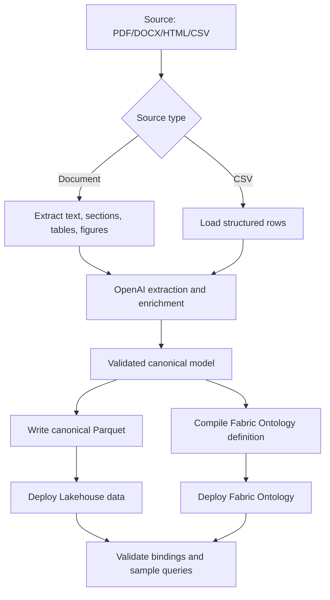

# Fabric KB Builder: Target Architecture

Date: 2026-06-24
Status: Handoff architecture for new project

## Overview

The new tool should be a source-agnostic CLI that turns documents and CSV-like inputs into Fabric-ready Parquet data and Fabric Ontology definitions.



## New Repo Skeleton

```text
fabric-kb-builder/
  pyproject.toml
  README.md

  docs/
    decision-snapshot.md
    architecture.md
    lessons-learned.md
    fabric-cicd-strategy.md

  src/
    fabric_kb_builder/
      __init__.py
      cli.py
      config.py

      sources/
        __init__.py
        csv_loader.py
        document_loader.py

      extraction/
        __init__.py
        document_extract.py
        llm_extract.py

      enrichment/
        __init__.py
        llm_enrich.py
        canonicalize.py
        ontology_mapper.py

      model/
        __init__.py
        schemas.py
        ids.py
        validators.py

      parquet/
        __init__.py
        writer.py
        schemas.py

      ontology/
        __init__.py
        compiler.py
        fabric_definition.py
        templates/

      deploy/
        __init__.py
        fabric_cicd.py
        fabric_rest.py
        lro.py

  ontology/
    model.yaml
    ids.lock.json
    environments/
      dev.json
      test.json
      prod.json

  examples/
    csv/
    documents/

  tests/
```

## CLI Commands

Initial command surface:

```powershell
fabric-kb init
fabric-kb inspect-source --input ./examples/csv/sample.csv
fabric-kb enrich --input ./examples/csv/sample.csv --out ./build/enriched
fabric-kb compile-data --input ./build/enriched --out ./build/parquet
fabric-kb compile-ontology --out ./build/ontology
fabric-kb package --out ./dist
fabric-kb deploy-data --env dev
fabric-kb deploy-ontology --env dev
fabric-kb validate --env dev
```

End-to-end command later:

```powershell
fabric-kb build-deploy --input ./sources --env dev
```

## Canonical Parquet Tables

Start with four tables.

### `source_files.parquet`

| Column | Purpose |
|---|---|
| `source_file_id` | Stable ID for input source. |
| `path` | Original source path. |
| `source_type` | `csv`, `pdf`, `docx`, `html`, etc. |
| `content_hash` | Change detection. |
| `ingested_at` | Processing timestamp. |

### `entities.parquet`

| Column | Purpose |
|---|---|
| `entity_id` | Stable canonical ID. |
| `entity_type` | Ontology type, e.g. `Device`, `Component`, `PartNumber`. |
| `display_name` | Human-readable label. |
| `canonical_key` | Normalized identity key. |
| `aliases` | List or JSON string of aliases. |
| `description` | LLM/human description. |
| `source_file_id` | Source lineage. |
| `confidence` | Extraction/enrichment confidence. |

### `relationships.parquet`

| Column | Purpose |
|---|---|
| `relationship_id` | Stable relationship ID. |
| `relationship_type` | Ontology relationship, e.g. `has_part`. |
| `source_entity_id` | Source node ID. |
| `target_entity_id` | Target node ID. |
| `evidence_id` | Provenance link. |
| `confidence` | Extraction confidence. |

### `evidence.parquet`

| Column | Purpose |
|---|---|
| `evidence_id` | Stable evidence ID. |
| `source_file_id` | Source file. |
| `source_type` | `csv_row`, `document_span`, `table_cell`, `figure_callout`. |
| `page_number` | Document page if available. |
| `section_path` | Heading / TOC context. |
| `table_id` | Table ID if available. |
| `row_index` | Table or CSV row index. |
| `col_index` | Table column index. |
| `figure_id` | Figure ID if available. |
| `callout_id` | Figure callout ID if available. |
| `text` | Supporting text or value. |

## Ontology Modules

Use one Fabric ontology with connected modules.

```text
SupportTechnicianOntology
  support-domain
    Device, Model, Component, Part, PartNumber, Tool,
    Symptom, Cause, Resolution, Procedure, Step

  document-evidence
    Document, Section, Page, Table, TableRow, TableColumn,
    TableCell, Figure, Callout, VisualRegion

  provenance
    evidenced_by, shown_in, identifies, source_section,
    extracted_from, applies_to
```

## Initial Ontology Model YAML

```yaml
name: SupportTechnicianOntology
version: 0.1.0

entityTypes:
  SupportEntity:
    abstract: true
    properties:
      entity_id: String
      display_name: String
      canonical_key: String
      description: String
      confidence: Double

  Device:
    base: SupportEntity

  Component:
    base: SupportEntity

  Part:
    base: SupportEntity

  PartNumber:
    base: SupportEntity

  DocumentElement:
    abstract: true
    properties:
      evidence_id: String
      source_file_id: String
      page_number: BigInt
      section_path: String

  TableCell:
    base: DocumentElement

  Figure:
    base: DocumentElement

relationships:
  has_component:
    source: Device
    target: Component

  has_part:
    source: Component
    target: Part

  has_part_number:
    source: Part
    target: PartNumber

  evidenced_by:
    source: SupportEntity
    target: DocumentElement
```

## Fabric Ontology CI/CD Packaging

Store clean JSON/YAML in Git. Compile to Fabric REST `definition.parts[]` at build time.

Fabric ontology definitions use parts like:

```text
.platform
definition.json
EntityTypes/{ID}/definition.json
EntityTypes/{ID}/DataBindings/{GUID}.json
RelationshipTypes/{ID}/definition.json
RelationshipTypes/{ID}/Contextualizations/{GUID}.json
```

Each part payload must be base64 encoded with `payloadType: InlineBase64`.

## Placeholder Strategy

The CLI should be able to generate placeholders from the static model, from observed source schema, or from LLM-inferred schema.

Examples:

```text
build/parquet/entities/_placeholder.parquet
build/parquet/relationships/_placeholder.parquet
build/ontology/EntityTypes/Device/definition.json
build/ontology/EntityTypes/Device/DataBindings/_placeholder.json
build/enriched/schema-profile.json
```

Placeholders let CI/CD deploy a scaffold before all source data or bindings are complete.
