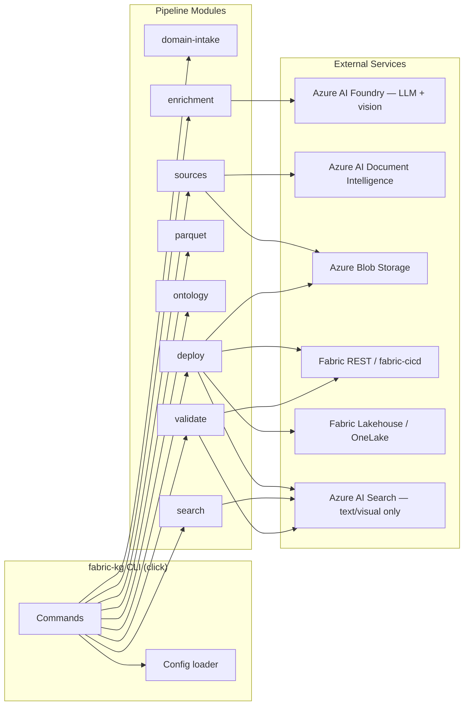
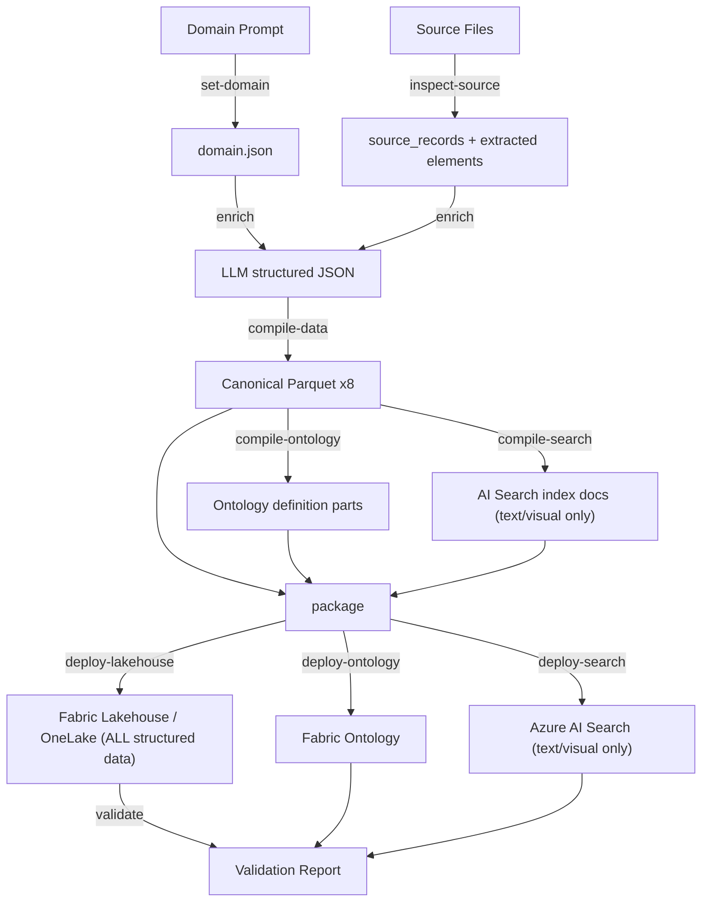

# SPEC-001: System Architecture & CLI Specification

**Status:** Draft  
**Date:** 2026-06-24T11:16:49.430-07:00  
**Author:** Keyser (Lead / Architect)  
**Derives from:** `docs/PRD.md` §1–§27

### Revision History

| Date | Author | Summary |
|---|---|---|
| 2026-06-24T11:16:49.430-07:00 | Keyser | Initial draft |
| 2026-06-24T11:46:10.517-07:00 | Keyser | v2 — `.env` secrets model; Foundry SDK replaces openai SDK; `deploy-data` → `deploy-lakehouse`; AI Search excludes structured data (Lakehouse only); domain-intake stage added; pipeline expanded to 12 stages; Document Intelligence required. See INFRA-001 for Azure resource inventory. |
| 2026-06-24T12:42:17.255-07:00 | Keyser | v3 — Model defaults locked: chat=GPT-5.5-mini (interim dev gpt-4.1), embedding=text-embedding-3-large@1536; embedding_dimensions config key added; 1536-dim coupling to AI Search documented; sample_data fixtures forward ref. |
| 2026-06-24T12:42:17.255-07:00 | Keyser | v4 — Canonical naming reconciliation: `compile-search-index` → `compile-search`; stage 2 `ingest` → `inspect-source`; config keys `vision_model_deployment` → `vision_deployment`, `foundry.project_name` → `foundry.project`; `.env` keys `AZURE_DOC_INTELLIGENCE_*` → `AZURE_DOCINTEL_*`; vision default = chat deployment (multimodal; gpt-4.1 interim / GPT-5.5-mini target), `example-vision`/`gpt-4o` as alternative; PRD coverage table updated; build-deploy pipeline sequence corrected. |
| 2026-06-24T15:41:07.842-07:00 | Verbal | v5 — Enrichment default corrected to gpt-5.4-mini (deployment `gpt-5-4-mini`, 200K TPM GlobalStandard); 200K TPM minimum documented in §5.1 and §10 decisions; AI Search corrected to IN MVP scope (decision 8); reference REQUIREMENTS-001 for setup. |

---

## 1. Scope & Purpose

This specification defines the system architecture, package layout, technology stack, configuration model, environment strategy, CLI command contract, build artifact layout, and cross-cutting concerns for the `fabric-kg-builder` project.

**PRD sections covered:**

| PRD Section | Topic | Coverage here |
|---|---|---|
| §1, §3 | Product summary & goals | §2 architecture |
| §8 | Target architecture | §2 pipeline stages |
| §9 | Ontology strategy | §2, §8 (ontology compiler) |
| §11 | AI Search layer | §2, §7 (compile-search) |
| §12 | Canonical Parquet tables | §8 artifacts |
| §14 | CLI commands | §7 full contract |
| §17 | Deterministic IDs | §5 config, §9 determinism |
| §19 | CI/CD | §7 build-deploy |
| §20 | Environments | §6 strategy |
| §21 | Validation | §7 validate command |
| §26 | Open questions | §10 open decisions |

---

## 2. High-Level Component Architecture

### 2.1 Pipeline Stages

| # | Stage | Module | Input | Output |
|---|---|---|---|---|
| 1 | **domain-intake** | `enrichment` | User domain prompt (CLI flag or file) | `build/enriched/domain.json` (normalized domain statement) |
| 2 | **inspect-source** | `sources` | Raw files (CSV, PDF, DOCX, HTML, images) | Normalized source records, extracted elements |
| 3 | **enrich** | `enrichment` | Source records + extracted elements + domain statement | Structured LLM JSON (entities, relationships, evidence, chunks, visual assets) |
| 4 | **compile-data** | `parquet` | Enriched JSON | 8 canonical Parquet tables (structured + unstructured) |
| 5 | **compile-ontology** | `ontology` | `ontology/model.yaml` + `ids.lock.json` + Parquet schema | Fabric Ontology definition parts |
| 6 | **compile-search** | `search` | Parquet tables — **text/visual artifacts only** (chunks, document_elements, visual_assets) | AI Search index schemas + documents |
| 7 | **package** | `cli` (orchestrator) | `build/*` artifacts | `dist/` deployment bundle |
| 8 | **deploy-lakehouse** | `deploy` | `dist/parquet/` + env config | Canonical structured data (CSV/Parquet) in Fabric Lakehouse / OneLake |
| 9 | **deploy-ontology** | `deploy` | `dist/ontology/` + env config | Fabric Ontology in target workspace |
| 10 | **deploy-search** | `deploy` | `dist/search/` + env config | AI Search indexes (text/visual only) |
| 11 | **validate** | `validate` | Deployed state + local artifacts | Pass/fail report |

> **Data routing rule:** Structured/tabular data (CSV, Parquet canonical tables) lands **exclusively** in the Fabric Lakehouse (OneLake). It is NOT indexed into Azure AI Search. AI Search is reserved for unstructured/text/visual retrieval (chunks, document elements, image descriptions, table HTML renderings).

### 2.2 Module Boundary Diagram



### 2.3 Data Flow (Ingest → Deploy)



> **Note:** Structured/tabular canonical Parquet tables (entities, relationships, evidence, source_files, etc.) are deployed to the Fabric Lakehouse and are queryable via Spark SQL / OneLake. They are **never** indexed into Azure AI Search. AI Search indexes only unstructured text and visual retrieval artifacts (chunks, document elements, image descriptions).

---

## 3. Repository / Package Layout

```
fabric-kg-builder/
├── src/
│   └── fabric_kg_builder/
│       ├── __init__.py
│       ├── cli/
│       │   ├── __init__.py
│       │   ├── main.py              # Click app entry point
│       │   ├── init_cmd.py
│       │   ├── set_domain_cmd.py    # Domain-intake command
│       │   ├── inspect_cmd.py
│       │   ├── enrich_cmd.py
│       │   ├── compile_data_cmd.py
│       │   ├── compile_ontology_cmd.py
│       │   ├── compile_search_cmd.py
│       │   ├── package_cmd.py
│       │   ├── deploy_cmd.py        # deploy-lakehouse, deploy-ontology, deploy-search
│       │   ├── validate_cmd.py
│       │   └── build_deploy_cmd.py
│       ├── config/
│       │   ├── __init__.py
│       │   ├── loader.py            # YAML + env var resolution
│       │   ├── schema.py            # Pydantic models for config
│       │   └── environments.py      # Per-env JSON loader
│       ├── sources/
│       │   ├── __init__.py
│       │   ├── base.py              # SourceLoader protocol
│       │   ├── csv_loader.py
│       │   ├── pdf_loader.py
│       │   ├── docx_loader.py
│       │   ├── html_loader.py
│       │   ├── image_loader.py
│       │   └── blob_uploader.py
│       ├── enrichment/
│       │   ├── __init__.py
│       │   ├── orchestrator.py      # Batch LLM calls with checkpointing
│       │   ├── prompts.py           # Prompt templates
│       │   ├── schemas.py           # Pydantic models for LLM output
│       │   └── checkpoint.py        # Resume long jobs
│       ├── model/
│       │   ├── __init__.py
│       │   ├── canonical.py         # Pydantic canonical entity/rel models
│       │   ├── evidence.py
│       │   ├── chunks.py
│       │   └── visual.py
│       ├── parquet/
│       │   ├── __init__.py
│       │   ├── writer.py            # PyArrow Parquet writer
│       │   ├── reader.py
│       │   └── schemas.py           # PyArrow schema definitions
│       ├── ontology/
│       │   ├── __init__.py
│       │   ├── compiler.py          # model.yaml → Fabric definition
│       │   ├── ids.py               # ids.lock.json manager
│       │   └── templates.py         # JSON templates for Fabric parts
│       ├── search/
│       │   ├── __init__.py
│       │   ├── index_compiler.py    # Parquet → AI Search docs
│       │   ├── schema_builder.py    # Index schema generation
│       │   └── embeddings.py        # Embedding generation
│       ├── deploy/
│       │   ├── __init__.py
│       │   ├── fabric_client.py     # Fabric REST wrapper
│       │   ├── lakehouse.py         # Data upload
│       │   ├── ontology_deploy.py   # Ontology REST deploy
│       │   ├── search_deploy.py     # AI Search index deploy
│       │   └── polling.py           # Long-running op polling
│       └── validate/
│           ├── __init__.py
│           ├── data_validator.py
│           ├── ontology_validator.py
│           ├── search_validator.py
│           └── rules.py             # Validation rule registry
├── ontology/
│   ├── model.yaml                   # Ontology type definitions
│   ├── ids.lock.json                # Deterministic Fabric IDs
│   └── environments/
│       ├── dev.json
│       ├── test.json
│       └── prod.json
├── tests/
│   ├── unit/
│   ├── integration/
│   └── fixtures/
├── examples/
│   └── csv/
│       └── sample.csv
├── docs/
│   ├── PRD.md
│   └── specs/
├── build/                           # Generated (gitignored)
├── dist/                            # Packaged (gitignored)
├── fabric-kg.yaml                   # Project config
├── pyproject.toml
└── README.md
```

---

## 4. Technology Stack Decisions

| Concern | Choice | Alternative considered | Rationale |
|---|---|---|---|
| CLI framework | **Click 8.x** | Typer | Click is mature, widely adopted, has no dependency on typing-extensions version conflicts. Typer adds an abstraction layer that can conflict with complex option groups. |
| Parquet I/O | **PyArrow** | pandas + fastparquet | PyArrow gives direct schema control, zero-copy reads, and no pandas dependency in core. Parquet schema is the data contract — we need explicit schema management. |
| Data validation / config | **Pydantic v2** | dataclasses + marshmallow | Pydantic v2 is fast, supports JSON Schema export, and handles both config validation and LLM output validation in one library. |
| LLM integration | **Microsoft Foundry SDK** (`azure-ai-projects`, Azure AI Foundry) | openai SDK (raw), litellm, langchain | Foundry SDK integrates with Azure AI Foundry for model management, project-level scoping, and unified auth via `DefaultAzureCredential`. Trade-off vs. raw `openai` SDK: slightly higher abstraction, but gains project/deployment-level governance and a single auth path. Verbal owns detailed LLM spec (SPEC-004). |
| Blob storage | **azure-storage-blob** | azure-identity + REST | SDK handles auth, retries, chunked upload. Standard Azure practice. |
| Fabric deployment | **Fabric REST API + fabric-cicd** | fabric-cicd only | fabric-cicd handles ontology definition push; direct REST needed for lakehouse data and long-running operation polling. |
| AI Search | **azure-search-documents** | REST-only | SDK handles index CRUD, document upload, vector fields. Well-maintained. |
| Testing | **pytest** | unittest | De-facto Python standard. Fixtures, parametrize, and plugin ecosystem. |
| Package management | **pyproject.toml + pip** | poetry, pdm | Simple, standard PEP 621. No extra tooling. |
| YAML parsing | **PyYAML + pydantic** | ruamel.yaml | PyYAML is sufficient for read-only config; pydantic validates after parse. |

---

## 5. Configuration Specification

### 5.1 `fabric-kg.yaml` — Non-Secret Configuration

`fabric-kg.yaml` holds all non-secret, structural configuration. Secrets (API keys, connection strings) are **never** stored here. Instead, secrets live in `.env` (see §5.2).

```yaml
# fabric-kg.yaml — project root (NO secrets — keys/credentials go in .env)
project:
  name: "my-kg-project"
  version: "0.1.0"

sources:
  input_dir: "./sources"
  types: ["csv", "pdf", "docx", "html", "image"]

enrichment:
  # Chat / enrichment model deployment
  # ⚠️ Minimum 200K TPM (capacity 200, GlobalStandard) required for the enrich stage.
  #    See docs/REQUIREMENTS-001-cli-prerequisites.md §6 for Foundry provisioning details.
  # Default: gpt-5-4-mini (gpt-5.4-mini @ 200K TPM) — note: gpt-5.5-mini does NOT exist.
  # Fallback: "chat" (gpt-4.1) if gpt-5-4-mini is unavailable in your hub.
  chat_deployment: "gpt-5-4-mini"
  # Vision deployment: default = chat deployment (multimodal)
  # Alternative: example-vision / gpt-4o (configurable via enrichment.vision_deployment)
  vision_deployment: "gpt-5-4-mini"
  # Embedding model deployment
  embedding_deployment: "text-embedding-3-large"  # fallback: text-embedding-3-small
  embedding_dimensions: 1536  # couples to AI Search chunk_vector field width — reindex if changed
  max_concurrent: 4
  checkpoint_dir: "./build/.checkpoints"

foundry:
  # Azure AI Foundry project reference (non-secret)
  project: "${AZURE_AI_FOUNDRY_PROJECT:-example-project}"
  endpoint: "${AZURE_AI_FOUNDRY_ENDPOINT}"   # resolved from .env

document_intelligence:
  endpoint: "${AZURE_DOCINTEL_ENDPOINT}"  # resolved from .env

blob_storage:
  account_name: "mystorageaccount"
  container: "kg-assets"

search:
  enabled: false
  service_name: "my-search-service"
  index_prefix: "kg"

ontology:
  model_file: "./ontology/model.yaml"
  ids_lock_file: "./ontology/ids.lock.json"
  environments_dir: "./ontology/environments"

deploy:
  method: "fabric-rest"  # "fabric-rest" | "fabric-cicd"

build:
  output_dir: "./build"
  dist_dir: "./dist"

logging:
  level: "INFO"  # DEBUG | INFO | WARNING | ERROR
  file: null     # Optional log file path
```

### 5.2 `.env` — Secret and Credential Storage

All secrets, API keys, and connection strings live in a `.env` file at the project root, loaded via `python-dotenv` at startup. **This file must never be committed to source control.**

```dotenv
# .env — project root (GITIGNORED — never commit)
# Azure AI Foundry (LLM + vision)
AZURE_AI_FOUNDRY_ENDPOINT=https://my-project.services.ai.azure.com
AZURE_AI_FOUNDRY_API_KEY=<your-foundry-api-key>

# Azure AI Document Intelligence
AZURE_DOCINTEL_ENDPOINT=https://my-doc-intel.cognitiveservices.azure.com
AZURE_DOCINTEL_API_KEY=<your-doc-intel-key>

# Azure Blob Storage
AZURE_STORAGE_CONNECTION_STRING=DefaultEndpointsProtocol=https;AccountName=...
# Or use a SAS token:
# AZURE_STORAGE_SAS_TOKEN=<your-sas-token>

# Azure AI Search (optional — only needed when search.enabled=true)
AZURE_SEARCH_ENDPOINT=https://my-search.search.windows.net
AZURE_SEARCH_API_KEY=<your-search-admin-key>

# Fabric deployment (optional — DefaultAzureCredential preferred)
# FABRIC_CLIENT_ID=<service-principal-client-id>
# FABRIC_CLIENT_SECRET=<service-principal-secret>
# FABRIC_TENANT_ID=<azure-ad-tenant-id>
```

**`.gitignore` guidance:** The project `.gitignore` MUST include:

```
.env
.env.*
!.env.example
```

An `.env.example` file with placeholder values SHOULD be committed as a schema reference.

> **Security reference:** See `.copilot/skills/secret-handling/SKILL.md` — agents must never read `.env` files or write secrets to committed files.

### 5.3 Precedence Rules

Resolution order (highest wins):

1. CLI flag (`--model gpt-5-4-mini`)
2. Environment variable (from `.env` or shell: `AZURE_AI_FOUNDRY_ENDPOINT=...`)
3. `fabric-kg.yaml` value (with `${ENV_VAR}` interpolation — variables resolve from .env / shell env)
4. Built-in default

> **Key principle:** `.env` is loaded into environment variables at startup. `fabric-kg.yaml` references those env vars by name using `${VAR}` syntax. The yaml file never contains raw secrets — only env-var references or non-secret values.

---

## 6. Environment Strategy

### 6.1 Environments

| Environment | Purpose | Data profile |
|---|---|---|
| **dev** | Fast iteration, sample data, local validation | Small subset, test workspace |
| **test** | Integration validation, representative data | Full representative set, staging workspace |
| **prod** | Governed deployment, full data | Complete data, production workspace |

### 6.2 Per-Environment JSON (PRD §20)

File: `ontology/environments/{env}.json`

```json
{
  "workspace_id": "xxxxxxxx-xxxx-xxxx-xxxx-xxxxxxxxxxxx",
  "lakehouse_item_id": "xxxxxxxx-xxxx-xxxx-xxxx-xxxxxxxxxxxx",
  "ontology_display_name_suffix": " (Dev)",
  "sensitivity_label": null,
  "blob_container": "kg-assets-dev",
  "blob_path_prefix": "dev/",
  "search_index_prefix": "kg-dev",
  "schema_name": "dbo"
}
```

### 6.3 Values That Vary vs. Stay Stable

| Category | Varies per env | Stays stable across envs |
|---|---|---|
| Fabric workspace ID | ✅ | |
| Lakehouse item ID | ✅ | |
| Blob container / path prefix | ✅ | |
| AI Search index names | ✅ | |
| Ontology display name suffix | ✅ | |
| Sensitivity label | ✅ | |
| Schema/table names | ✅ (rare) | |
| Ontology model (`model.yaml`) | | ✅ |
| Ontology type IDs (`ids.lock.json`) | | ✅ |
| Parquet schema definitions | | ✅ |
| Entity/relationship type names | | ✅ |
| Pipeline logic & prompts | | ✅ |
| AI Search index field schemas | | ✅ |

---

## 7. CLI Command Contract

### 7.1 Global Options

| Flag | Type | Default | Purpose |
|---|---|---|---|
| `--config` | path | `./fabric-kg.yaml` | Config file path |
| `--env` | choice | `dev` | Target environment |
| `--verbose` / `-v` | flag | false | DEBUG logging |
| `--quiet` / `-q` | flag | false | ERROR-only logging |
| `--dry-run` | flag | false | Show plan, do not execute |

### 7.2 Command Details

#### `fabric-kg init`

| Attribute | Value |
|---|---|
| **Purpose** | Scaffold a new project with config, ontology model, and directory structure |
| **Pipeline stage** | — (setup) |
| **Inputs** | `--template` (optional: `default`, `csv-only`) |
| **Outputs** | `fabric-kg.yaml`, `ontology/model.yaml`, `ontology/ids.lock.json`, `ontology/environments/*.json`, `sources/` dir |
| **Exit codes** | 0 = success, 1 = error, 2 = already initialized (skip) |
| **Idempotency** | Skip-if-exists for each file/dir (never overwrites) |

#### `fabric-kg set-domain`

| Attribute | Value |
|---|---|
| **Purpose** | Intake a user-provided domain prompt to narrow and focus LLM enrichment. The normalized domain statement becomes an input to all subsequent enrichment calls. |
| **Pipeline stage** | domain-intake (first-class stage, runs before enrich) |
| **Inputs** | `--prompt "..."` (inline domain text) OR `--domain-file PATH` (path to a text file containing the domain description) |
| **Outputs** | `build/enriched/domain.json` — persisted domain statement with metadata |
| **Exit codes** | 0 = success, 1 = error |
| **Idempotency** | Overwrites existing `domain.json`. Re-runnable. |
| **Storage format** | `domain.json`: `{ "domain_prompt": "<original user text>", "normalized_at": "<timestamp>", "source": "cli" }` |

> **⚠️ SECURITY REQUIREMENT:** The user's domain text is injected **only** into the LLM **user prompt** (message role = `user`), **NEVER** into the system prompt. This is a hard security constraint to prevent prompt injection from user-supplied domain text reaching the system instruction layer. Verbal owns the detailed prompt template design (SPEC-004); this spec defines the CLI contract and storage location.

> **Flow into enrichment:** When `fabric-kg enrich` runs, it reads `build/enriched/domain.json` (if present) and passes the `domain_prompt` value to the enrichment orchestrator. The orchestrator injects it into the user-role portion of each LLM call. If no `domain.json` exists, enrichment proceeds without domain narrowing.

> **Alternative usage:** `fabric-kg enrich --domain-prompt "..."` is also supported as a convenience flag that writes `domain.json` and then proceeds with enrichment in one step.

#### `fabric-kg inspect-source`

| Attribute | Value |
|---|---|
| **Purpose** | Analyze source files and report schema, types, row counts, detected structure |
| **Pipeline stage** | inspect-source |
| **Inputs** | `--input PATH` (required: file or directory) |
| **Flags** | `--format` (`table` | `json`), `--output` (file path, default stdout) |
| **Outputs** | Schema profile report to stdout or file |
| **Exit codes** | 0 = success, 1 = error, 3 = unsupported source type |
| **Idempotency** | Pure read; always safe to re-run |

#### `fabric-kg enrich`

| Attribute | Value |
|---|---|
| **Purpose** | Run LLM extraction and enrichment on source files; produce structured JSON |
| **Pipeline stage** | enrich |
| **Inputs** | `--input PATH` (required), `--model` (override), `--max-concurrent N`, `--domain-prompt "..."` (optional — writes domain.json then enriches) |
| **Flags** | `--resume` (continue from checkpoint), `--force` (ignore checkpoint), `--domain-file PATH` (alternative to `--domain-prompt`) |
| **Outputs** | `build/enriched/*.json` (per-source enrichment results), `build/enriched/domain.json` (if domain provided) |
| **Exit codes** | 0 = success, 1 = error, 4 = partial (some files failed, checkpoint saved) |
| **Idempotency** | With `--resume`, re-runnable. Without, overwrites `build/enriched/` |

#### `fabric-kg compile-data`

| Attribute | Value |
|---|---|
| **Purpose** | Convert enriched JSON to canonical Parquet tables |
| **Pipeline stage** | compile-data |
| **Inputs** | `--input PATH` (default: `build/enriched`) |
| **Flags** | `--out PATH` (default: `build/parquet`), `--validate` (run schema checks) |
| **Outputs** | 8 Parquet files in output dir |
| **Exit codes** | 0 = success, 1 = error, 5 = validation failure |
| **Idempotency** | Deterministic; same input → same output. Overwrites output dir. |

#### `fabric-kg compile-ontology`

| Attribute | Value |
|---|---|
| **Purpose** | Generate Fabric Ontology definition parts from model + IDs |
| **Pipeline stage** | compile-ontology |
| **Inputs** | `--model PATH` (default from config), `--ids PATH` (default from config) |
| **Flags** | `--out PATH` (default: `build/ontology`), `--include-placeholders` |
| **Outputs** | Fabric ontology JSON parts (EntityTypes/, RelationshipTypes/, definition.json, .platform) |
| **Exit codes** | 0 = success, 1 = error, 5 = model validation failure |
| **Idempotency** | Deterministic; same model+IDs → same output. |

#### `fabric-kg compile-search`

| Attribute | Value |
|---|---|
| **Purpose** | Generate AI Search index schemas and document batches from **text/visual Parquet tables only** (chunks, document_elements, visual_assets). Structured/tabular data (entities, relationships, evidence, source_files) is NOT included — that data lives in the Fabric Lakehouse. |
| **Pipeline stage** | compile-search |
| **Inputs** | `--input PATH` (default: `build/parquet`) |
| **Flags** | `--out PATH` (default: `build/search`), `--indexes` (comma-separated list), `--embed` (generate embeddings) |
| **Outputs** | `build/search/{index-name}/schema.json`, `build/search/{index-name}/documents/*.json` |
| **Exit codes** | 0 = success, 1 = error, 5 = schema mismatch |
| **Idempotency** | Deterministic given same Parquet + embedding model. |

> **Scope constraint:** Only unstructured/text/visual tables are indexed: `chunks`, `document_elements`, `visual_assets` (image descriptions, table HTML). The command ignores `entities.parquet`, `relationships.parquet`, `evidence.parquet`, and `source_files.parquet`. Those are queryable via the Fabric Lakehouse / OneLake.

#### `fabric-kg package`

| Attribute | Value |
|---|---|
| **Purpose** | Bundle all build artifacts into a deployment-ready dist package |
| **Pipeline stage** | package |
| **Inputs** | `--build-dir PATH` (default: `build/`) |
| **Flags** | `--out PATH` (default: `dist/`), `--include-search` (include AI Search artifacts) |
| **Outputs** | `dist/` with parquet/, ontology/, search/ (optional), manifest.json |
| **Exit codes** | 0 = success, 1 = error |
| **Idempotency** | Overwrites dist/. Deterministic from build/. |

#### `fabric-kg deploy-lakehouse`

| Attribute | Value |
|---|---|
| **Purpose** | Upload canonical structured data (CSV/Parquet tables) to the Fabric Lakehouse / OneLake datalake |
| **Pipeline stage** | deploy-lakehouse |
| **Inputs** | `--env ENV` (required), `--dist PATH` (default: `dist/`) |
| **Flags** | `--tables` (comma-separated subset), `--force` (overwrite existing) |
| **Outputs** | Lakehouse tables created/updated |
| **Exit codes** | 0 = success, 1 = error, 6 = auth failure |
| **Idempotency** | Re-upload is safe; tables are overwritten by design. |

#### `fabric-kg deploy-ontology`

| Attribute | Value |
|---|---|
| **Purpose** | Deploy compiled Fabric Ontology definition to workspace |
| **Pipeline stage** | deploy-ontology |
| **Inputs** | `--env ENV` (required), `--dist PATH` (default: `dist/`) |
| **Flags** | `--poll-timeout SECONDS` (default: 300) |
| **Outputs** | Fabric Ontology created/updated in target workspace |
| **Exit codes** | 0 = success, 1 = error, 6 = auth failure, 7 = timeout |
| **Idempotency** | Uses deterministic IDs; re-deploy updates in place. |

#### `fabric-kg deploy-search`

| Attribute | Value |
|---|---|
| **Purpose** | Create/update AI Search indexes and upload text/visual document batches (no structured data) |
| **Pipeline stage** | deploy-search |
| **Inputs** | `--env ENV` (required), `--dist PATH` (default: `dist/`) |
| **Flags** | `--indexes` (subset), `--recreate` (drop and recreate index) |
| **Outputs** | AI Search indexes populated |
| **Exit codes** | 0 = success, 1 = error, 6 = auth failure |
| **Idempotency** | Document upload uses merge-or-upload; index create is idempotent. |

#### `fabric-kg validate`

| Attribute | Value |
|---|---|
| **Purpose** | Validate deployed state against local artifacts and rules (PRD §21) |
| **Pipeline stage** | validate |
| **Inputs** | `--env ENV` (required) |
| **Flags** | `--rules` (subset of rules), `--report PATH` (output report file) |
| **Outputs** | Validation report (stdout or file). Lists pass/fail per rule. |
| **Exit codes** | 0 = all pass, 1 = error, 8 = validation failures found |
| **Idempotency** | Pure read; always safe to re-run. |

#### `fabric-kg build-deploy`

| Attribute | Value |
|---|---|
| **Purpose** | End-to-end: domain-intake → inspect-source → enrich → compile-data → compile-ontology → compile-search → package → deploy-lakehouse → deploy-ontology → deploy-search → validate |
| **Pipeline stage** | All |
| **Inputs** | `--input PATH` (required), `--env ENV` (required) |
| **Flags** | `--skip-search` (omit AI Search stages), `--resume`, `--force` |
| **Outputs** | Full pipeline output + deployed state |
| **Exit codes** | 0 = success, 1 = error, 4 = partial enrichment, others = stage-specific |
| **Idempotency** | With `--resume`, re-runnable from last checkpoint. |

### 7.3 Exit Code Summary

| Code | Meaning |
|---|---|
| 0 | Success |
| 1 | General error (see stderr) |
| 2 | Already initialized / no-op |
| 3 | Unsupported source type |
| 4 | Partial enrichment (checkpoint saved) |
| 5 | Validation / schema failure |
| 6 | Authentication failure |
| 7 | Timeout (long-running op) |
| 8 | Validation failures in deployed state |

---

## 8. Build Artifact Layout

```
build/
├── enriched/                    # Stage: domain-intake + enrich
│   ├── domain.json              # Persisted domain statement (from set-domain)
│   ├── source-1.enriched.json
│   ├── source-2.enriched.json
│   ├── schema-profile.json
│   └── .checkpoint/             # Resumable state
├── parquet/                     # Stage: compile-data
│   ├── source_files.parquet
│   ├── document_elements.parquet
│   ├── chunks.parquet
│   ├── entities.parquet
│   ├── relationships.parquet
│   ├── evidence.parquet
│   ├── visual_assets.parquet
│   └── visual_regions.parquet
├── ontology/                    # Stage: compile-ontology
│   ├── .platform
│   ├── definition.json
│   ├── EntityTypes/
│   │   └── {ID}/
│   │       ├── definition.json
│   │       └── DataBindings/
│   │           └── {GUID}.json
│   └── RelationshipTypes/
│       └── {ID}/
│           ├── definition.json
│           └── Contextualizations/
│               └── {GUID}.json
└── search/                      # Stage: compile-search
    ├── kg-chunks/
    │   ├── index.schema.json
    │   └── documents/
    │       └── batch-001.json
    └── kg-document-elements/
        ├── index.schema.json
        └── documents/
            └── batch-001.json

dist/                            # Stage: package
├── manifest.json                # Package metadata + checksums
├── parquet/                     # Copy from build/parquet
├── ontology/                    # Copy from build/ontology
└── search/                      # Copy from build/search (optional)
```

### 8.1 Stage Input/Output Matrix

| Stage | Consumes | Produces |
|---|---|---|
| domain-intake (set-domain) | User domain prompt (CLI or file) | `build/enriched/domain.json` |
| inspect-source | Raw source files | Schema profile (stdout/file) |
| enrich | Raw source files + config + domain.json (optional) | `build/enriched/*.json` |
| compile-data | `build/enriched/` | `build/parquet/*.parquet` |
| compile-ontology | `ontology/model.yaml`, `ids.lock.json`, Parquet schemas | `build/ontology/` |
| compile-search | `build/parquet/` — **text/visual tables only** (chunks, document_elements, visual_assets) | `build/search/` |
| package | `build/*` | `dist/` |
| deploy-lakehouse | `dist/parquet/` + env config | Fabric Lakehouse / OneLake state (all structured data) |
| deploy-ontology | `dist/ontology/` + env config | Fabric Ontology state |
| deploy-search | `dist/search/` + env config | AI Search index state (text/visual only) |
| validate | Deployed state + env config | Validation report |

---

## 9. Cross-Cutting Concerns

### 9.1 Logging

| Aspect | Design |
|---|---|
| Library | Python `logging` with structured formatter |
| Levels | DEBUG (verbose), INFO (progress), WARNING (non-fatal issues), ERROR (failures) |
| Output | stderr for logs, stdout for command output/data |
| Format | `[{timestamp}] {level} {module}: {message}` |
| File logging | Optional via config (`logging.file`) |
| Correlation | Each pipeline run gets a `run_id` (UUID) attached to all log records |

### 9.2 Error Handling

| Pattern | Implementation |
|---|---|
| User-facing errors | `CliError` exception hierarchy → Click exits with code + message |
| Recoverable errors | Logged as WARNING; processing continues |
| Unrecoverable errors | Logged as ERROR; exit with appropriate code |
| LLM errors | Retry with exponential backoff (3 attempts); checkpoint on persistent failure |
| Network errors | Retry transient (429, 500, 503) with backoff; fail-fast on 401/403 |
| Validation errors | Collected and reported as a batch; exit code 5 or 8 |

### 9.3 Checkpointing for Long LLM Jobs

```
build/enriched/.checkpoint/
├── state.json          # { "completed": [...], "pending": [...], "failed": [...] }
├── source-1.result.json
└── source-2.result.json
```

| Aspect | Design |
|---|---|
| Granularity | Per-source-file |
| Storage | JSON in `.checkpoint/` directory |
| Resume | `--resume` flag reads state.json; skips completed files |
| Force | `--force` flag deletes checkpoint; restarts from scratch |
| Failure handling | Failed files recorded in state.json with error; exit code 4 |
| Timeout | Per-file timeout configurable; default 120s per LLM call |

### 9.4 Determinism Guarantees

| Guarantee | Mechanism |
|---|---|
| Ontology IDs | `ids.lock.json` — deterministic across all environments |
| Entity IDs | Content-addressed: `sha256(entity_type + canonical_key)[:16]` |
| Relationship IDs | Content-addressed: `sha256(rel_type + source_id + target_id)[:16]` |
| Parquet output | Sorted by primary key before write; no timestamp columns in data identity |
| Build reproducibility | Same source files + same config → same build artifacts (excluding enrichment, which depends on LLM) |
| LLM non-determinism | Acknowledged; mitigated by checkpointing and validation, not guaranteed bit-identical |

---

## 10. Open Architecture Decisions

These map to open questions from the PRD (§26) and prior Keyser analysis.

| # | Decision | Default Recommendation | Status |
|---|---|---|---|
| 1 | Fabric dev workspace selection | Use team shared dev workspace; configure in `ontology/environments/dev.json` | **Open** — needs workspace ID from team |
| 2 | Auth method for Fabric deployment | `DefaultAzureCredential` (supports SP, managed identity, and user via `az login`) | **Recommended** |
| 3 | Deployment approach (REST vs. fabric-cicd) | Use `fabric-cicd` for ontology definition push; direct REST for Lakehouse upload and long-running ops | **Recommended** |
| 4 | Default LLM model for text | **gpt-5.4-mini** (deployment `gpt-5-4-mini`, 200K TPM GlobalStandard on `example-aiservices`); fallback deployment `chat` (gpt-4.1). **Minimum 200K TPM required** for the enrich stage — see `docs/REQUIREMENTS-001-cli-prerequisites.md` §6. Note: `gpt-5.5-mini` does not exist. Configured via `enrichment.chat_deployment` in `fabric-kg.yaml`. | **Locked** |
| 5 | Default model for vision/image | Default = chat deployment (`gpt-5-4-mini`, multimodal). `example-vision` / gpt-4o documented as alternative. Configurable via `enrichment.vision_deployment`. | **Locked** |
| 6 | Document extraction library | **Azure AI Document Intelligence** (REQUIRED) for PDF/images — OCR text + bounding polygons for visual_regions (SPEC-002); `python-docx` for DOCX; `beautifulsoup4` for HTML | **Locked** |
| 7 | Blob Storage account/container | Configure per-env in environment JSON; no hardcoded account | **Open** — needs account from team |
| 8 | AI Search in MVP scope | **IN MVP scope** (enabled in dev, `search.enabled=true` in `dev.json`). Text/visual retrieval only — structured data stays in Lakehouse. | **Locked** |
| 9 | LLM checkpoint strategy | Per-source-file JSON checkpoints in `build/enriched/.checkpoint/` | **Locked** (this spec) |
| 10 | ID generation for entities | Content-addressed hash (deterministic, collision-resistant) | **Locked** (this spec) |
| 11 | LLM SDK | **Microsoft Foundry SDK** (`azure-ai-projects`) — replaces raw `openai` SDK | **Locked** |
| 12 | Secrets / config separation | `.env` for secrets; `fabric-kg.yaml` for non-secret config; env-var interpolation | **Locked** |
| 13 | Domain intake step | `fabric-kg set-domain` — domain prompt injected into USER prompt only (never system prompt) | **Locked** |
| 14 | Default embedding model | **text-embedding-3-large** @ `dimensions=1536` (fallback: text-embedding-3-small @ 1536). Configured via `enrichment.embedding_deployment` + `enrichment.embedding_dimensions` in `fabric-kg.yaml`. | **Locked** |
| 15 | Embedding ↔ Search coupling | `embedding_dimensions=1536` must match the AI Search `chunk_vector` field width (SPEC-002 `chunk_vector` / RESEARCH-001 §4). Changing the embedding model or dimension requires a full reindex of all AI Search data. | **Locked** |

---

## 11. Test Data / Build Fixtures

| Path | Purpose | Sprint |
|---|---|---|
| `sample_data\Surface_Troubleshootings\*.pdf` | Sample PDF documents for e2e grounding tests and fixture generation | Sprint 2+ (forward ref → SPEC-005) |

> These files are **reserved** — they are NOT processed during Sprint 1 or the CSV-only MVP. They will be consumed by integration tests and e2e validation once the document extraction pipeline (Azure Document Intelligence) is implemented. See SPEC-005 for the test plan.

---

## Appendix A: Key Dependencies (pyproject.toml)

```toml
[project]
name = "fabric-kg-builder"
requires-python = ">=3.10"
dependencies = [
    "click>=8.1",
    "pydantic>=2.0",
    "pyarrow>=14.0",
    "pyyaml>=6.0",
    "azure-ai-projects>=1.0",         # Microsoft Foundry SDK (LLM + vision)
    "azure-ai-documentintelligence>=1.0",  # Document Intelligence (OCR, layout)
    "azure-storage-blob>=12.0",
    "azure-identity>=1.15",
    "python-dotenv>=1.0",
]

[project.optional-dependencies]
search = ["azure-search-documents>=11.4"]
docs = ["python-docx>=1.0", "beautifulsoup4>=4.12"]
dev = ["pytest>=7.0", "pytest-cov", "ruff"]

[project.scripts]
fabric-kg = "fabric_kg_builder.cli.main:cli"
```

---

## Appendix B: Glossary

| Term | Meaning |
|---|---|
| Canonical Parquet | The 8 Parquet tables that form the durable data contract |
| Ontology definition | Fabric-compatible JSON parts (EntityTypes, RelationshipTypes, bindings) |
| Enrichment | LLM-based extraction producing structured JSON |
| Evidence | Provenance link from a fact to its source location |
| Checkpoint | Saved state for resuming interrupted LLM jobs |
| ids.lock.json | Deterministic ID mapping for Fabric ontology types |
